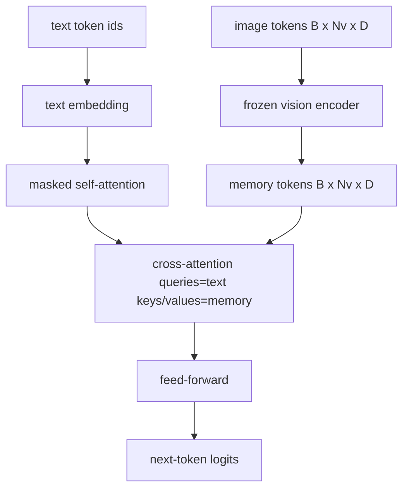
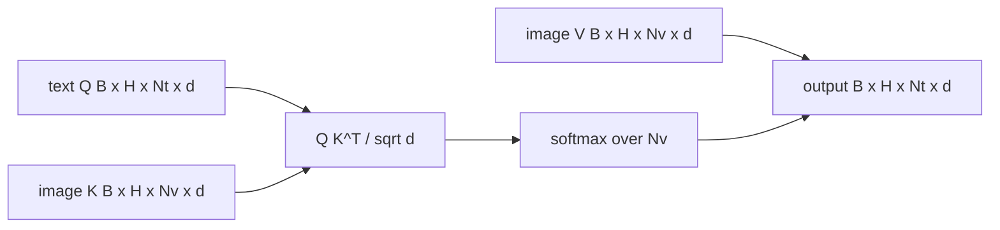

# 跨注意力融合

> 投影层将一个图像向量与一个标题向量对齐. 实际的视觉语言解码器需要每个文本代码来关注每个补丁代码, 通过注意力来实现这种地定. 文本问答;视觉关键和价值 这一课建立了跨越注意力区块,因果性文本自我注意力,

**Type:** Build
**Languages:** Python
**Prerequisites:** Phase 19 lessons 30-37 (Track B foundations)
**Time:** ~90 minutes

## 学习目标

- 实现多头交叉注意力,其中查询流是文本,键/值流是视觉.
- 编写一个解码器块:因果自我注意+横向注意+传递.
- 按正确的面具形状:因果性面具用于自我注意力,没有面具用于横向注意力.
- 运行一个前进通行,包含批量文字代币和固定的图像代币池.

## 问题

结合图像代币和文本代币成一个序列是一个融合选项 (早期融合,Chameleon和Emu3走路).交叉注意力是另一种 (后期融合,Flamingo引入的路径,并且自此以来每个Flamingo形的解码器都复制了).在后期融合中,文本解码器仅使用文本代币运行,通过交叉注意力在每个层中进入图像流.

后期融合有两个优势.一是,文本流保持清洁,模型保留仅为文本的功能.二是,图像流每图像计算一次,每次解码步骤都会再使用,因此生成即使是长片标题便宜.成本是每块额外的注意次层.

## 概念





### 面具的形状

解码器区内的两个注意力需要不同的面具:

| Attention | Query length | Key length | Mask | Why |
|-----------|--------------|------------|------|-----|
| Self-attention | `Nt` (text) | `Nt` (text) | Causal: lower-triangular `(Nt, Nt)` | Text tokens may not look ahead during autoregression |
| Cross-attention | `Nt` (text) | `Nv` (vision) | No mask | The whole image is visible to every text position |

课程包括一个形状验证函数,所以混合它们的错误是`ValueError`而不是一个然破碎的损失曲线.

### 为什么没有面具在跨注意力

在生成任何文本之前,图像会被完全观察.`t`某些Flamingo变体在交织多个图像和文本段时添加一个样本按模式,但对于单个图像加上一个标题,交叉注意力可以看到一切.

### 密钥/值缓存

图像密钥和值在解码开始时计算一次,并存储在缓存中.每个新文本代币都使用缓存,而不需要重新计算.这就是导致标题快速推断的原因:重量 ViT一次运行;跨重视频每一步都会重新使用其密钥和值.课程暴露缓存并测试缓存击中的路径.

### 组合

解码器区块运行:LN前 ->自我注意 ->残留 ->LN前 ->横向注意 ->残留 ->LN前 ->向前 ->残留.三个子层,每个层都有自己的LayerNorm.Flamingo论文增加了学习的跨向注意的门,以便模型可以选择在训练时间稳定成本下退出图像路径;正规的基线 (在这里使用) 没有门.

```python
class DecoderBlock:
  def forward(self, text_tokens, image_tokens, text_mask, cross_mask):
      text_tokens = text_tokens + self.self_attn(self.ln1(text_tokens),
                                                 mask=text_mask)
      text_tokens = text_tokens + self.cross_attn(self.ln2(text_tokens),
                                                  image_tokens,
                                                  mask=cross_mask)
      text_tokens = text_tokens + self.ffn(self.ln3(text_tokens))
      return text_tokens
```

```figure
ch-crossattn-fan
```

## 建立它

`code/main.py`执行:

- `CrossAttention(hidden, heads)`双头交叉注意力,`q`其他`kv`预测
- `CausalSelfAttention(hidden, heads)`通过标准解码器来隐藏自我注意.
- `DecoderBlock`组建三个子层,含有LN前残留物.
- `VisionLanguageDecoder`通过假视觉编码器输出和一个小的文本嵌入表提供四层解码器.
- `causal_mask(length)`返回一个`(length, length)`低三角形的布尔尔子.
- 显示一个节目,以长度10的两个文本序列提供一个节目,具有长度197的图像内存,并打印出口形,自我注意力面具形状,每个位置的跨注意力输出标准.

运行它:

```bash
python3 code/main.py
```

输出:解码器产生一个`(2, 10, text_vocab)`子的形状是`(10, 10)`缓存和未缓存的路径之间的相同的登录.

## 用它

两种生产家庭中出现了交叉关注:

- **Flamingo and IDEFICS.**每个K语言模型块都插入一个跨注意次层,并使用一个结的LM.视觉语言适配器是跨注意区块加上它的门.
- **BLIP-2.**图像功能中使用32个查询代币的固定集合的交叉注意力,然后将查询投射到LM嵌入空间中.

面具纪律 (因子自在,没有因子交叉) 是相同的.

## 测试

`code/test_main.py`覆盖:

- 原因面膜是下方三角形,与预期的布尔形状相匹配
- 交叉注意力输出形状是`(B, Nt, hidden)`无论钥匙长度如何
- 基动机缓存路径与未缓存路径和浮动耐受性相匹配
- 文字和图像流之间的形状不匹配,`ValueError`
- 一个完整的解码器前传输产生了正确的批量和序列形状

运行它们:

```bash
python3 -m unittest code/test_main.py
```

## 运动

1. 加入一个学习的门,并验证训练从接近零的初始门汇聚.门开始于0;模型在混合图像流之前恢复仅仅是文本的行为.

2. 实现交叉关注,当同一解码器使用多个图像和多个文本段时. 构建每样本交叉关注面具,防止文本段 2 加入图像 1.

3. 介绍跨注意与自我注意层`Nt=64, Nv=576`跨重视成本是 `Nt * Nv`它们的图像分辨率很高.

4. 在交叉注意力地图上添加查询侧的置,并在演示中测量标题多样性 (随着交叉地图中置,标题样本差异增加).

5. 交换跨注意层,以Q-Former式的注意区块,其中一个固定的32代币查询池每层一次关注图像功能.

## 关键词

| Term | What it means |
|------|---------------|
| Late fusion | Text and vision stay in separate streams; cross-attention bridges them at every block |
| Cross-attention | Q comes from one stream, K and V from another |
| Causal mask | Lower-triangular boolean mask that prevents looking ahead during autoregression |
| KV cache | Image keys and values stored once and reused for every decode step |
| Memory tokens | The frozen image tokens that the decoder reaches into |

## 进一步阅读

- 弗拉明戈 (2022) 用于加нони化后期融合设计,具有门口交叉注意力.
- 对于Q-Former来说,BLIP-2 (2023) 是一个穿着学习查询池的跨注意区块.
- 为了对"弗拉门戈"配方进行公重复制,IDEFICS (2023)
