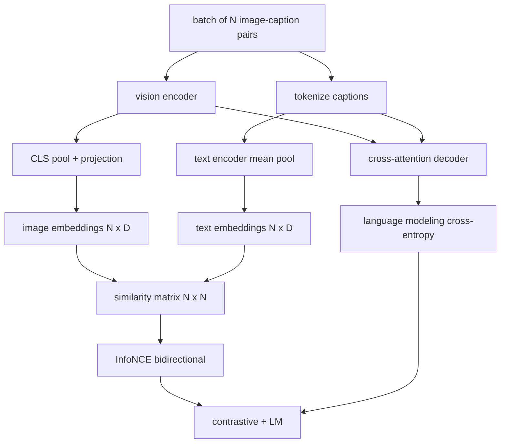

# 预备视觉语言

> 编码器,投影器和解码器是有线的.现在将它们训练在一起.两个目标推动学习:对比图像文本损失 (InfoNCE),该系统将匹配的对合在联合嵌入空间中拉在一起,以及语言建模损失,该系统要求解码器标题每个图像.

**Type:** Build
**Languages:** Python
**Prerequisites:** Phase 19 lessons 30-37 (Track B foundations)
**Time:** ~90 minutes

## 学习目标

- 实现InfoNCE对比损失在一批图像标题对.
- 复合对比性损失与自动降低性语言建模损失.
- 合成一个200对假的图像标题,
- 运行一个50步的演示训练循环,

## 问题

视觉语言模型需要两个技能.它必须排名:给出一个标题,在许多中找到正确的图像.它必须生成:给出一个图像,写一个标题.仅仅在一个技能上预训练模型就能给你一半的系统.Clip钉排名但不能标题.GPT-4V可以标题,但使用一个独立的检索头来排名.多目标预训练可以在一个通过中获得两者.

对于一批N对,模型将N匹配对作为正面和`N^2 - N`结果是,在数值中,`(N, N)`类似性矩阵. LM 损失处理生成的一半:标准下一个代币预测,根据图像.这两个损失都可分化,可以共享编码器,投影器和解码器重量.

## 概念



### 信息NCE在一个段落中

堆叠N图像嵌入式为行列和N文字嵌入式为行列. L2-正常化.计算 `N x N`矩阵`S = I T^T / tau`在哪里`tau`角进口是相匹配的对,外面进口是负. 应用与目标交叉透`argmax`沿线线走向:行`i`应该是列中最高的入口`i`总数是两个的平均值.这是8行的Clip损失.

### 温度是重要的

温度`tau`控制软max的峰值.`tau = 0.01`升率只有最强的负值,训练是的.太大,软max平坦化,升率消失.`tau`作为一个参数,这里的演示也是这样.

### 语言建模损失

解码器通过交叉注意力消耗图像内存代币,并在每个位置预测下一个文本代币.损失是标准的交叉透与下一个位置目标.接位置被掩盖.

### 结合损失

`total = contrastive + lm_weight * lm`在哪里`lm_weight`两种损失在编码器和投影中分享梯度;只有解码器获得LM-loss梯度.这是CoCa,BLIP和SigLIP类型模型使用的多任务配方,具有各种权重.

| Component | Loss surface | Affects |
|-----------|--------------|---------|
| InfoNCE | Pair ranking in the joint space | Encoder + projection + text head |
| LM | Token prediction conditioned on image | Encoder + projection + decoder |
| Combined | Multi-task | Whole stack |

### 为什么50步足以演示

假装体是一个合成200对组,有随机图像和随机标题ID. 随着50个SGD步骤的批量大小16次,即使绝对值保持在现实数据模型达到的水平以上,两者均显著下降.演示的目的是确认梯度管道工作的终结,并表示添加LM损失不会破坏对比目标的稳定.

```figure
ch-infonce-diagonal
```

## 建立它

`code/main.py`执行:

- `MultimodalModel`结合一个小的ViT编码器,MLP投影器,一个小的文本侧编码器 (嵌入式ID的平均积分),和课题61的跨注意力解码器.
- `info_nce_loss(image_emb, text_emb, temperature)`双向Clip类对比损失.
- `lm_loss(logits, target_ids, padding_id)`罩在下一个代币的交叉.
- `make_mock_corpus(seed, n_pairs)`返回200个确定性 (图像,字幕_ID) 对.
- 训练循环运行50步,配套尺寸16个,亚当优化器,以及学习日志温度参数.

运行它:

```bash
python3 code/main.py
```

产量:比较的损失从大约下降`ln(16) = 2.77`随机均基线的LM损失从2.4向下降`ln(512) ≈ 6.24`实际模型训练数百万步,动态是相同的.

## 用它

这就是送来的同样的损失配方:

- **CLIP (2021).**只有图像和文字对比,有单独的冷编码标题探测器.
- **CoCa (2022).**图像-文字对比加上图像标题的LM损失在一个模型. 这一课构建的确切模式.
- **BLIP (2022) and BLIP-2.**复杂加上LM加上图像和文字匹配头,共3次损失.
- **SigLIP (2023).**换取InfoNCE为sigmoid对损失;相同的对比作用,不同的功能形式.
- **LLaVA family.**两个阶段的训练,其中第一阶段是对齐 (结的LM上的结) 第二阶段增加了结的LM损失. 第60课程将第一阶段映射,这课程将第二阶段映射.

## 测试

`code/test_main.py`覆盖:

- 信息NCE损失在图像/文本行中对称
- 当相似性矩阵是大正数的完美角角时,InfoNCE损失返回0
- 光损失正确掩盖填充位置
- 输出输出输出输出输出输出输出输出输出输出输出输出输出输出输出输出输出输出输出输出输出输出输出输出输出输出输出输出输出输出输出输出输出输出输出输出输出输出输出输出输出输出输出输出输出输出输出输出输出输出输出输出输出输出输出输出输出输出输出输出输出输出输出输出输出输出输出输出输出输出输出输出输出输出输出输出输出输出输出输出输出输出输出输出输出输出输出输出输出输出输出输出输出输出输出输出输出输出输出输出输出输出输出输出输出输出输出输出输出输出输出输出输出输出输出输出输出输出输出输出输出输出输出输出输出输出输出输出输出输出输出输出输出输出输出输出输出输出输出输出输出输出输出输出输出输出输出输出输出输出输出输出输出输出输出输出输出输出输出输出输出输出输出输出输出输出输出输出输出输出输出输出输出输出输出输出输出输出输出输出输出输出输出输出输出输出输出输出输出输出输出输出输出输出输出输出输出输出输出输出输出输出输出输出输出输出输出输出输出输出输出输出输出
- 五步训练循环减少了总损失

运行它们:

```bash
python3 -m unittest code/test_main.py
```

## 运动

1. 替换InfoNCE以SigLIP式的sigmoid对损失,并对模拟体上的融合进行比较.

2. 添加一个硬负矿山步骤:每次分组,从前一批中选择最硬的离线对,并添加它. 训练并检查对比损失是否会更快地下降.

3. 在联合嵌入的顶部添加一个图像-文本匹配的二元头 (真/假:这些匹配吗?) 为第三个输出,复制BLIP的三头设置.

4. 取代假冒体格用从一个马科夫链中提取的标题标识序列,其过渡矩阵是基于图像哈希的.标题丢失应该进一步下降,因为实际的可学习信号存在.

5. 训练同一个模型`lm_weight = 0`再一次,`lm_weight = 1`较量损失;LM损失不应退向排名目标.

## 关键词

| Term | What it means |
|------|---------------|
| InfoNCE | Noise contrastive estimation: cross-entropy on a similarity matrix |
| Temperature | Scalar that controls how peaked the contrastive softmax is |
| Hard negative | An off-diagonal pair the model finds confusing, useful for sampling |
| LM loss | Standard next-token cross-entropy on the captioning side |
| Joint embedding space | The shared space where image and text vectors live after projection |

## 进一步阅读

- 对于原始的对比食谱的Clip纸.
- 对于一个模型的对比性加上字幕的CoCa纸.
- 对于sigmoid对损失变体的siglip纸,以及为什么它更好地扩展.
