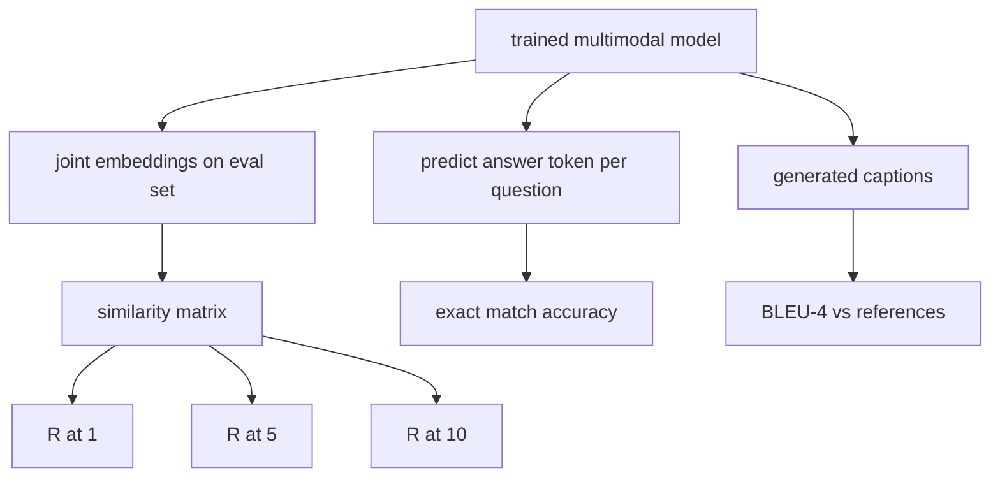

# 多型评估

> 训练是半循环.另一半是测量.这个课程从原始的基础上构建了三个评估表面:图像标题检索报告为R@1,R@5,R@10;视觉问题回答报告为精确匹配准确性;图像标题报告为BLEU-4.每个度量是模型输出的函数和合成评估套件,运行在秒钟内.

**Type:** Build
**Languages:** Python
**Prerequisites:** Phase 19 lessons 58-62 (Track E foundations: encoder, transformer, projection, cross-attention fusion, pretraining)
**Time:** ~90 minutes

## 学习目标

- 计算图像和标题嵌入之间的类似性矩阵 Recall@K.
- 从绘制对 (图像,问题) 的模型计算到固定答案词汇库的精确匹配VQA准确性.
- 根据生成的代币序列计算BLEU-4,并且没有任何外部库.
- 运行所有三个评估与一个合成套件建立在训练模型的上课62.

## 问题

试图在训练损失平原时宣布一个多模模型完成.训练损失量度适合训练分布;它不测量模型是否可以在一批被持久的批量中排名对,回答问题,或写一个字幕一个人会接受.三个评估表面是标准的:

- **Retrieval (R@1, R@5, R@10).**构建查询标题的联合嵌入;按代数排列评估池中的每个图像;报告是否匹配图像落在前1位,前5位,前10位.对称 (图像到文本) 形式运行相同.
- **Visual question answering (exact match).**给出 (图像,问题),模型输出了一个答案代号. 精确的匹配是每样本的一位:预测答案是否等于参考答案?
- **Captioning (BLEU-4).**生成标题. 计算1克到4克精度的几何平均值与参考标题,使用简短处罚.多引用是标准形式 (一个图像,多个参考标题).

每个指标都是一个薄型的函数.课程都以代码构建它们,所以数学是具体的,表面保持在你的控制之下.真正的基准套件 (MS-COCO,VQA v2,GQA,OK-VQA) 插入相同的函数形状.

## 概念



### 从类似性矩阵中回忆@K

建立一个`(N, N)`图像和标题嵌入之间的共数相似性矩阵. 按下降的相似性来排序列. 记住@K是线索对角列指数位于顶部K位置的部分. 交换矩阵的代码是: 报道了两位数字. 对于N=100的评价,R@1 =0.6意味着60个标题中100个获取了正确的图像作为顶部匹配.

### 完全匹配的VQA

对于每一个图像 (图像,问题,答案),编码图像,嵌入问题,通过解码器并阅读下一个标志. 预测的代币ID与参考ID进行比较;如果等,则正确. 平均值超过评估集. 实际的VQA数据集每一个问题都包含多个人注释的答案,使用柔软精度公式 (1.0如果至少有3个注释者同意,以下缩小);课程使用单个答案的精确匹配来提供清晰度.

### 蓝色-4

```text
BLEU-4 = BP * exp(mean(log p1, log p2, log p3, log p4))
```

在哪里?`p_n`是修改的 n-gram精度 (任何参考中出现的生成 n-gram 的剪切数量,分为生成的 n-gram 总数),以及`BP`是短暂的处罚:

```text
BP = 1                if generated length > reference length
   = exp(1 - r/g)     otherwise, where r is reference length and g is generated
```

需要滑滑小样本,其中一些样本`p_n`实现使用陈和桃"方法 1" (为任何零数量添加1到数量和命名器),这是低数量模式的最安全默认.

### 合成评估套件

根据第62课中使用的模拟体格,在内存中构建了一个50个样本的评估套件,其中有一个持久的种子.

- `pairs`: 50 (图片,字幕_字幕) 对可检索.
- `vqa`图片,问题,答案:50倍
- `caps`: 50 (图片, [引用_标题_字符, ...]) 条目每张图片最多有3个引用.

套件是从种子中确定性的,并从训练体中延伸出来,因此测量表是基于模型从未见过的数据计算的.将套件保持到JSON是作为一个练习 (见下面).

| Metric | Range | Random baseline (N=50) |
|--------|-------|------------------------|
| R@1 | 0 to 1 | 0.02 (1 / N) |
| R@5 | 0 to 1 | 0.10 |
| R@10 | 0 to 1 | 0.20 |
| VQA EM | 0 to 1 | 1 / vocab |
| BLEU-4 | 0 to 1 | small but nonzero |

对于基于合成数据的50步训练,预计测量不会高,预计将超过随机基线,这是演示测试的结果.

```figure
ch-recall-window
```

## 建立它

`code/main.py`执行:

- `recall_at_k(sim_matrix, k)`回一个浮动的`[0, 1]`两方向都会发生.
- `vqa_exact_match(predictions, references)`返回平均值`int`平等.
- `bleu4(generated, references, smoothing=True)`通过多个参考支持.
- `build_eval_suite(seed, n_samples, vocab_size, max_len)`返回三个确定性评估列表.
- `evaluate(model, suite)`运行所有三个指标,返回一个`dict`它们是数字的.
- 通过一个测试,从第62课中装载一个新启动的多模式模型, 评估它, 然后训练它50步,

运行它:

```bash
python3 code/main.py
```

输出:前后的表表显示,从近随机到模型学习的信号的检索改善,VQA在随机上改善,BLEU-4的改善 (合成结构足以实现4克精密升降).

## 用它

每个指标直接映射到生产基准指标上:

- **Retrieval.**基于相同的类似性矩阵的R@K问题,可以将合成的 eval取代为真实文件,并且函数签名保持不变.
- **VQA.**VQA v2,GQA,OK-VQA使用相同的完全匹配形状 (VQA v2 采用软 acc 而不是单响应 EM).
- **BLEU-4.**加入CIDEr是另一个功能.

对于真正的基准,交换`build_eval_suite`算法是基准无知的.

## 测试

`code/test_main.py`覆盖:

- 返回回回0在完美的身份相似性矩阵上,并返回0在翻转的矩阵上为k < N
- 提醒@k尊重`k <= N`上边界
- 当生成时, bleu4返回1.0是相当于一个引用的确切值
- 蓝色4返回了0.0的分离词汇库
- 完全匹配的vqa等于等于等对的分数
- build_eval_suite返回预期对数,vqa项和标题入口

运行它们:

```bash
python3 -m unittest code/test_main.py
```

## 运动

1. 添加CIDEr到标题指标中.CIDEr使用TF-IDF权重在n克,从而奖励信息代币.

2. 实施柔性精度VQA:每一个问题多个人答案,精度是`min(human_count / 3, 1)`如果有任何匹配,则复制VQA v2.

3. 添加一个安全的 NaN 变体`bleu4`无需毁,处理空格生成的序列.

4. 计算与R@K的平均对方级别 (MRR).MRR对正确项落在顶部K之外的位置敏感;R@K对它落在顶部K是否敏感.

5. 在训练期间,在五个检查点 (步骤0, 10, 20, 30, 40, 50) 运行模型的评估,绘制学习曲线.确认测量轨迹跟踪损失轨迹.

## 关键词

| Term | What it means |
|------|---------------|
| R@K | Fraction of queries where the correct match lands in the top K results |
| Exact match | The simplest VQA scoring: predicted answer equals reference |
| BLEU-4 | Geometric mean of 1- to 4-gram precisions, with brevity penalty |
| Multi-reference | A captioning metric accepts several reference captions per image |
| Held-out | The eval set is sampled from a seed disjoint from the training corpus |

## 进一步阅读

- 软精度公式和数据集统计的VQA v2文件.
- 对于TF-IDF权重 n克字幕的CIDER纸.
- 对于滑滑变体,BLEU原始 (Papineni等人,2002).
- 标题标题的MS-COCO评价脚本用于可信参考实现.
