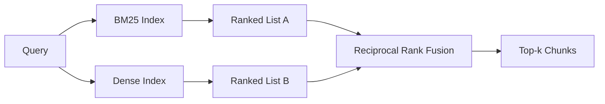

# 混合式检索,使用BM25和密集嵌入式

> 复式检索与相互排列融合的混合检索不交叉,它投票 - 投票赢得每个查询类.

**Type:** Build
**Languages:** Python
**Prerequisites:** Phase 11 lessons 04 (embeddings), 06 (RAG); Phase 19 Track B foundations (lessons 20-29); Phase 19 lesson 64 (chunking strategies)
**Time:** ~90 minutes

## 学习目标
- 从罗伯逊和斯帕克·斯的公式中从零开始实现BM25,使用场面权重,文件长度正常化,以及可调节的k1和b.
- 建立一个密集的回收器, 建立一个定性模拟嵌入式,
- 按照科尔麦克,克拉克和布埃特切尔2009年发表的情况,实施相互级别融合,并解释为什么它占据了分数权重的插图.
- 调整RRF k常量和每种模式权重,并在小的固定器件体上读取交易.

## 问题

字母搜索获胜,当查询包含字面标识符时,该表包含字面标识.`AbortMultipartOnFail`在微秒内通过BM25返回正确的Go函数.相同的查询,嵌入式,位于三个相似度集群的边界,密集的检索器首先排名错误的文件.

密集搜索在查询被抛词而远离体积的字面标记时获胜.一个用户问"我们如何处理取消的上传"从来没有打入"取消"或"多部分"这个词.BM25将文件部分返回"上传大型文件"上,因为该页面包含"上传"这个词.密集检索发现了"取消"这个函数,总结中提到取消.

两个之间的选择不是静态的.查询分布是变量.一个生产RAG系统从同一端点处理两个类,所以检索必须同时处理两类.这就是混合检索. 合并步骤是必须正确的部分.

## 概念



### 在一个段落中,BM25

BM25通过在查询条件上总算一个反向文件频率因子乘以一个和术语频率因子,包括长度正常化纠正.`k1`标准的1.5是公布的建议,并且您不应该没有基准值移动它. `b`根据标准的0.75 个标准,长文件会受到惩罚,但不是线性.

据说,以色列国防军使用了罗伯逊和斯帕克·斯的定义,`log((N - df + 0.5) / (df + 0.5) + 1)`总体而言,在一个小组中, 关键词技术上很少存在.

字段权重让你告诉BM25符号名称上的匹配比体内的匹配更重要. 实现是指数过程中的术语数量的乘法,而不是得分时间. 这使得数学保持相同,避免每个字段的分分分分.

### 密集的检索在一个段落

嵌入每个部分在一个固定维度向量中,使用嵌入模型.在查询时,嵌入查询,通过相似性排名每个部分,并返回顶部k.模型是决定质量的变量.检索算法本身是两个线:点产量和排序.

这一课使用确定性基于哈希的嵌入式,以便您可以在没有网络调用的情况下阅读融合数学.哈希将代币键的抵消数量加成96维向量并正常化.测试套件所要求的代数数数列是确定性跨行.

### 相互级别融合,公布的公式

两名排名名.对于每位名单中出现在的候选人,总结其相互排名贡献. 2009年论文使用`1 / (k + rank)`按总分数排序.这是整个算法.

发表的常数 k = 60 不是任意的.在 k = 60 时,排名-1贡献是1/61和排名-10贡献是1/70. 贡献会慢慢衰退,所以深层的候选人仍然投票.较小的 k 让顶级结果占主导地位.较大的 k 方便了贡献曲线.

两个调节式按在我们的实施.`k`根据标准,一个对比的数量是不变的.一个对比的数量是不变的.一个对比的数量是不变的.一个对比的数量是不变的.一个对比的数量是不变的.一个对比的数量是不变的.一个对比的数量是不变的.一个对比的数量是不变的.一个对比的数量是不变的.一个对比的数量是不变的.一个对比的数量是不变的.一个对比的数量是不变的.一个对比的数量是不变的.一个对比的数量是不变的.一个对比的数量是不变的.一个对比的数量是不变的.一个对比的数量是不变的.

### 为什么合比分权重插射更好

 BM25分数是无限的,依赖于体积. 科西因相似性是以 -1 到 1 边界的.`alpha * bm25 + (1 - alpha) * cosine`根据排名的融合没有.两个排名可以在各个模式中比较. 发表的RRF基线比2010年以来在每个公共TREC轨道中分数插入.

它们得出相同的结论:除非有非常强有力的证据来调整分数.

```figure
rrf-fusion
```

## 建立它

`code/main.py`执行:

- `tokenize(text)`- 一个快速的regex标记.
- `BM25Index`- 按场面权重,`add`其他`search`置式 k1, b.
- `mock_embed`现在`DenseIndex`它们的分数是可比较的.
- `rrf(rankings, k, weights)`- 已公布的多模式权重融合.
- `HybridRetriever`- 结合BM25和密集.
- 一个演示`main()`运行三个查询,针对每个回收器的强度和弱点, 并打印出每个模拟的排名,

运行它:

```bash
python3 code/main.py
```

阅读示范输出一边.字面标识查询到BM25排名1,密集排名4,RRF排名1. 抛词查询到BM25排名6,密集排名1,RRF排名1. 模糊查询到BM25排名3,密集排名3,RRF排名1. 融合不是打破;它是每一个查询类中赢得的系统.

## 调节子

| Knob | Default | Move it up when | Move it down when |
|------|---------|----------------|------------------|
| BM25 k1 | 1.5 | Terms repeat in documents and you want frequency to matter more | Documents are short and term repetition is noise |
| BM25 b | 0.75 | Long documents really do say less per word | Document length is uncorrelated with topic |
| RRF k | 60 | Deep candidates should keep voting | The top-1 should dominate |
| BM25 weight | 1.0 | Your corpus contains literal identifiers and queries match them | Your queries are user-paraphrased |
| Dense weight | 1.0 | Queries are paraphrased | Queries are literal |

通过重新运行第68课的评估, 调整你的保留查询集, 不是直觉.

## 失败模式的演示将隐藏

**Out-of-vocabulary tokens.**密集嵌入式对同一术语进行幻觉.在外体识别器上,密集模拟 returns plausible-looking but wrong neighbors. 融合吸收了这一点,因为BM25返回什么都没有,而排名贡献下降,但只有如果你通过文档,而不是通过分片进行复制.

**Stop-token domination.**根据"the"的词,BM25在表格上产生统一排名. 过索引中的停止代币或接受高IDF术语自然占主导地位.

**Identical content across modalities.**如果你的体积足够小,以至于BM25的顶-1也是密集的顶-1,RRF给你带来了相同的邻居的顶-1.这是正确的行为,不是失败,但它使得融合看起来看不见.在你的评估中添加一个对立查询对来验证融合实际上是有效的.

## 用它

生产模式:

- 索引BM25在进程中;瓶是术语频率字典,而不是向量.
- 在单独的商店中索引密集向量 (在这一课中我们使用平面列表;在生产中,您将使用HNSW).
- 运行两个查询并行; 融合是连接的持续时间合并.
- 保持每次获取的重击方式,以便下游重新排名者可以看到哪种方式投票支持它.

## 运送它

第66课从本课中取出了合并的顶k,并用一个跨码器重新排列. 第68课精确评估整个管道,回忆,MRR和nDCG.本课中的混合回收器是第69课中的端到端系统的第一阶段.

## 运动

1. 取代`mock_embed`运行演示,并报告如何在抛词查询中变化.
2. 加入第三种方式:分别索引的零件总结,并作为第三排名列表合并.
3. 扫描RRF k在 10, 30, 60, 100, 200 上. 从第68课程绘制回忆@k曲线. 报告曲线在你的体积上达到的 k 的值.
4. 运行BM25F正确 (每场长度正常化而不是乘法技巧) 并在符号匹配最重要的体积上进行比较.

## 关键词

| Term | What people say | What it actually means |
|------|-----------------|------------------------|
| BM25 | "Lexical search" | Probabilistic ranking with idf x saturating tf x length normalization |
| RRF | "Rank fusion" | Sum of 1 / (k + rank) across ranked lists; k = 60 default |
| k1 | "TF saturation" | Controls how fast a repeated term stops adding more score |
| b | "Length penalty" | 0 means ignore document length, 1 means full normalization |
| Field weighting | "Symbol boost" | Repeat tokens during indexing to boost matches in that field |
| Rank-based vs score-based fusion | "Why RRF beats linear" | Ranks are comparable across modalities; scores are not |

## 进一步阅读

- 科尔麦克,克拉克,布埃特切尔,"互惠级别融合优于康多塞特和个人级别学习方法",SIGIR 2009
- 罗伯逊,沃克,伯利,加特福德,佩恩,"在TREC-3的Okapi" (原本BM25纸)
- [Vespa: Hybrid Retrieval with BM25 and Embeddings](https://docs.vespa.ai/en/tutorials/hybrid-search.html)
- [Weaviate: Hybrid Search](https://weaviate.io/developers/weaviate/search/hybrid)
- 第十一阶段第六课 - RAG基本面
- 第19阶段课时64 - 产量在这里被索引
- 阶段19课66 - 跨编码重排器消耗了融合的顶-k
