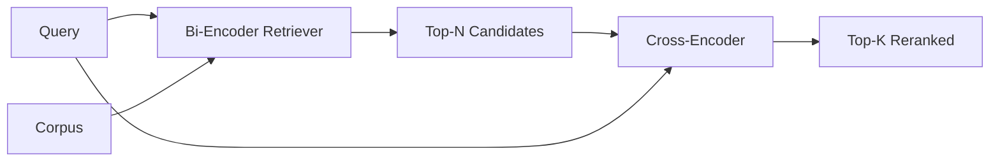

# 跨编码器重排器

> 双码码器独立嵌入查询和文档. 交叉码器连接它们并同时读取它们. 交叉码码器是最聪明的读者和最慢的. 作为双码码器的顶部k的第二阶段,它自行支付.

**Type:** Build
**Languages:** Python
**Prerequisites:** Phase 11 lesson 06 (RAG), Phase 11 lesson 07 (advanced RAG); Phase 19 Track B foundations (lessons 20-29); Phase 19 lesson 65 (hybrid retrieval feeding this stage)
**Time:** ~90 minutes

## 学习目标
- 根据输入形状,参数数数和每次查询成本,区分双码码检索器与跨码码重排器.
- 从零开始,将一个小的跨编码器作为一个用包 (查询,文档) 的变压器块,并发出单个相关性尺度.
- 通过两阶段的检索再排名管道:通过便宜的检索器检索N顶部,通过交叉编码器重新排名N至顶部K,返回K.
- 测量一个小的固定器件体上的延迟与质量交换,并选择给定的延迟预算的正确N.

## 问题

双编码器将查询和文档映射到同一向量空间中,并按二数排列.两个编码器从来没有见过彼此.模型必须将有关文档的所有有用信息压缩到单个向量中,盲目对查询.这很快 - 每个文档在索引时间内嵌入一个,每一个查询在查询时间内嵌入一个 - 这也是在体积尺度上排名的唯一方法.

两个具有相同的总体主题的文件可能具有几乎相同的嵌入式,即使其中一个回答了查询,而另一个没有.双编码器无法区分它们.

通过阅读查询和文档一起来解决这个问题.`[query] [SEP] [document]`作为一个单个序列,通过连接进行了全重视,并产生了一个相关性尺度.文件的每个符号可以参加查询的每个符号.模型决定了完整的文本.

代价是吞吐量. 双码码器嵌入一次并永远查询,交叉码码器运行一次 (查询,文档) 双.对于一个1000万的文档体,这每查询是1000万前进通行.在请求预算中无法运行.

解决方案是阶段化.使用双码码器检索上层N.使用交叉码器重新排名N至上层K.N小 (50至200),交叉码器的质量升级集中在重要的地方.总延迟保持在请求预算中.总质量是交叉码器的质量,由双码码器在N召回限制.

## 概念



### 交叉编码器输入形状

标准包装是`[CLS] query_tokens [SEP] document_tokens [SEP]`某些实现使用平均聚合而不是CLS;差异很小. 问题是,模型每对产生一个数字.

通过22M参数交叉编码器 (已发布的`ms-marco-MiniLM-L-6-v2`较小的模型比节省延迟更快地失去质量.较大的模型 (例如:`bge-reranker-v2-m3`在568M参数) 时,这些参数仅用于非线重新排名或在K小时重新排名第一页.

### 为什么这个课程训练一个小孩子

在生产中,你加载一个检查点并运行它. 在这个课程中,目标是向你展示模型的形状和延迟质量曲线的形状,而不是训练一个最先进的排名器.所以我们构建了一个小的`nn.Module`具有一个变压器块,多头注意力 (默认4头),和一个回归头.它从种子中初始化,因此演示可以在磁盘上重量无需重复.

玩具模型从固定器件组中学习正确的形状:相关查询文件对比的预测分数比无关的对比更高.端到端管道将双编码器输出量重新排列,重排的顶级k与黄金标签相关.

### 延迟与质量

在一个持久的查询集中扫描N从5到100,然后得到曲线.

| N | Recall@1 of stage 2 | Cross-encoder forward passes per query | Latency |
|---|--------------------|---------------------------------------|---------|
| 5 | 0.62 | 5 | low |
| 20 | 0.81 | 20 | medium |
| 50 | 0.86 | 50 | high |
| 100 | 0.86 | 100 | very high |

上面的数字说明了形状,而不是从这个装置的测量.形状是真实的.总有一只膝盖在20到50个候选人中,重新排名升降和.

通过加上延迟预算,选择N从评估曲线中. 交叉编码器不能提高回忆值超过双编码器的回忆值在N,因此低的N限制质量,而不仅仅是延迟.

```figure
rerank-funnel
```

## 建立它

`code/main.py`执行:

- `CrossEncoder`- 一个小的`torch.nn.Module`:代号嵌入,一个变压器块,多头注意力和反式,平均聚合式头产生一个 skalar.
- `tokenize_pair(query, document)`- 将两个字符串包装成一个单个 id 序列,其中标记着边界,确定性和 stdlib 的类型 id.
- `train_tiny(pairs)`- 一次监督培训,在手动标记的三项列表上 (查询,文档,相关性),因此模型在设备上产生了合理的分数.
- `rerank(query, candidates, top_k)`- 生产界面.
- `pipeline(query, retriever, top_n, top_k)`- 两阶段的流量.
- 一个演示`main()`通过将课程65的模式加载,检索N的顶部,将其排列到K的顶部,印出了两列表,并报告了每个阶段的延迟.

运行它:

```bash
python3 code/main.py
```

输出显示双码码器的顶N,交叉码码器的顶K和时间总结.交叉码码器每次通话需要更长时间,但不会在整个体内运行.两个阶段的总数保持在请求预算内,同时选择双码码器排名第二或第三的答案.

## 失败模式的演示将隐藏

**Cross-encoder is not symmetric.** `rerank(q, d)`其他`rerank(d, q)`总是先输入查询. 如果你意外地交换,回忆会崩.

**N is too low to expose the bug.**如果设置N=K,交叉编码器不能重新排序,它只能重重.升降器看起来是零.选择N至少是K的3倍.

**Training data leaks into the eval.**如果手动标记的训练对包括评估查询,重新排名看起来很神奇. 严格分开训练和评估,即使在一个固定.

**Production weights are dense.**在 float32 上,一个22M参数跨码器为88MB. 在承诺 sub-100ms p95之前,计划模型服务器的内存.

**Batching matters.**实际的交叉编码器将N个候选人运行在一个批量中.`_batch_encode`通过                                            `torch.tensor(...)`通过一个前进传输, 跳过批量, 延迟乘以N.

## 用它

生产模式:

- 关键双码码,交叉码码和N在一起.改变任何一个使评估无效.
- 缓存缓存输出 (查询,document_id) 哈希.与稳定体相对的相同查询对相同的顺序进行缓存;缓存击中可以免费减缓延迟.
- 记录1级跨编码分数.一个比分高于1级的查询是域外的击中;将其表达给LLM为"我不确定".

## 运送它

第68课评估了这两阶段的管道端到端. 第69课将这种重排器在第65课中的混合回收器后面和答案生成器前面.重排器是端到端系统的第二阶段.

## 运动

1. 扫描N从5到50,然后绘制重新排名输出的回忆@1. 在这个装置上找到膝盖.
2. 训练交叉编码器进行十个时代,而不是一个.
3. 换一个CLS标记头,并将这种装置的融合进行比较.
4. 添加一个第二个跨编码头,预测一个二进制"文件中是这个答案"标签. 在推断时使用两个头;一个是排名,一个是门.
5. 取代确定性模拟双码器用第65课中的一个,链接两个阶段. 测量顶部K与单双码器的变化.

## 关键词

| Term | What people say | What it actually means |
|------|-----------------|------------------------|
| Bi-encoder | "Vector retriever" | Encodes query and doc independently; cosine ranks them |
| Cross-encoder | "Reranker" | Encodes (query, doc) jointly; outputs one relevance scalar |
| Two-stage pipeline | "Retrieve and rerank" | Cheap retriever returns N, expensive reranker keeps K |
| N (candidate budget) | "Rerank pool" | The number of candidates the cross-encoder scores per query |
| Mean-pooling head | "Mean of last hidden" | Average the encoder's last-layer outputs into one vector |

## 进一步阅读

- 诺格耶拉,乔, "通过BERT重新排名", 2019 - 经典的跨编码排名论文
- 雷默斯,古雷维奇, "Sentence-BERT:使用西安式BERT网络的句子嵌入", 2019 - 关于双码器与交叉码器
- [SentenceTransformers Cross-Encoders documentation](https://www.sbert.net/examples/applications/cross-encoder/README.html)
- [BGE Reranker v2 model card](https://huggingface.co/BAAI/bge-reranker-v2-m3)
- 第19阶段课65 - 混合式取器提供了这个重排阶段的食物
- 阶段19课68 - 评估测量这一重排的升级
