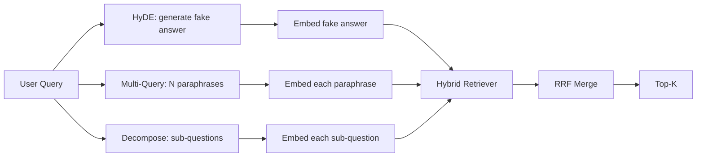

# 查询重写:HyDE,多查询和分解

> 查询用户输入的查询不是查询器想要的查询. 重写将在查询之前的差距弥合,因此索引会看到更接近答案的东西.

**Type:** Build
**Languages:** Python
**Prerequisites:** Phase 11 lessons 04 (embeddings), 06 (RAG); Phase 19 Track B foundations (lessons 20-29); Phase 19 lessons 64 and 65
**Time:** ~90 minutes

## 学习目标
- 实现假设文件嵌入 (HyDE):生成一个假答案,嵌入它,取回该向量而不是查询向量.
- 实现多查询扩展:重写一个查询成N句子,与每个引用,通过相互排列融合将联盟合并.
- 实现查询分解:将复杂问题分为子问题,每一个子问题检索,并合并.
- 让我们比较三个重写器的位置,
- 导航一个假的LLM,产生定性,固定输出,

## 问题

一个用户输入"当上传失败,预算消失时,我们的团队会做什么?" 文件中包含一个文件,上面写道:"AbortMultipartOnFail 停止了飞行中的S3多部分上传, 查询和文档没有任何名词.  BM25失败了. 双编码器将文档排名第三或第四,因为查询向量落入嵌入空间的一个区域,该区域更喜欢关于取消的任务的文档,而不是关于取消的上传的文档. 如果它坐在N上方,则课66中的二阶级重新排名可以拯救答案,

解决方案是在它触及回收器之前重新写查询. 2023年"精确零射击密集检索没有相关标签" (Gao等) 论文引入了HyDE:要求LLM写出将回答查询的文件,嵌入该假设文件,并使用其嵌入作为检索向量. 假设文件位于嵌入空间的右侧,因为它是用体体的声音写的. 查询向量没有.

两种表妹技术与HyDE结合. 多查询扩展 (微软使用的GraphRAG术语) 生成查询的N句子并与每个引用,然后合并. 解散 (在2024年斯坦福DSPy研究中被称为"下列查询解散") 将"当上传失败时我们的团队做什么,预算失败时"分为两个问题: 两个检索,一个合并结果,两个部分的答案可达成.

这一课将所有三个都实现,并将它们与同一架构相对.

## 概念



### 详细的海德

代取代用户查询向量为LLM编写的假设文档向量.提示是简短的:

```
You are a domain expert. Write a one-paragraph passage that answers the question
below. Use the same vocabulary and phrasing the documentation in this domain would
use. Do not refuse. Do not say you do not know.

Question: {user_query}

Passage:
```

法律法师的答案是错误的,因为法律法师不了解你的体积. 这很好. 回者不关心事实正确性,只关心标志性分配. 假设的段落包含"堕胎","多部分","桶","预算"的词, 嵌入这个通道. 矢量落地在真实通道附近.

在制作中,你将假设文档限制在两个或三个句子上.较长的假设文本收集更多的噪音.较短的文本输掉了HyDE所需的词汇信号.

### 多项查询的详细扩展

生成用户查询的N句子.

```
Rewrite the following question in {N} different ways. Each rewrite must preserve
the original intent. Number them 1 to {N}. Do not add explanations.
```

取回每句话的顶部k.将N排列列列表与RRF (65课程相同的算法) 合并.

复式查询是用户的句子提出问题的许多有效方式之一,任何重写都会更好地提出问题. 所有重写都一样糟糕,因为原始的情况同样糟糕.

### 详细分解

解散要求LLM将问题分为子问题,系统则每一个子问题取回.提示:

```
The following question may require information from multiple distinct topics.
Decompose it into a list of sub-questions. Each sub-question must be answerable
independently. If the question is already atomic, return it unchanged.

Question: {user_query}
```

解散是包含连结,多条款比较或两个不相关的主题的问题,错误的原子问题工具;解散者的工作是返回单个问题,而不是发明假的子问题.

### 为什么三者都存在

综合测试系统 (HyDE) 解决了查询-库的代币差距.多查询覆盖了语法变异.分解覆盖了多主题查询.一个生产系统运行了三个,并选择了每个查询的策略 (第69课的端到端系统显示了选择器).

## 假的法定法学士

课程开启在线.假 LLM 是一个小的查找表,按用户查询键,加上没有看到的查询的反弹.查找表包含:

- 对于每一个固定查询:一个写的假设段落,三个句子,
- 对于未知查询:确定性转换:取查询内容单词,通过同义词地图扩展它们,然后返回结果.

假冒的形状是重要的,而不是数据. 在生产中,你把假冒换成真实模型调用.

```figure
cd-hyde-vector
```

## 建立它

`code/main.py`执行:

- `MockLLM`- 上述的决定性替代.
- `HyDERewriter`- 要求法师写下假设文件,返回重写器输出为`RewriteResult`检索器应该使用的假设文本和查询.
- `MultiQueryRewriter`- 要求法师提供N句子,返回查询列表.
- `DecomposeRewriter`- 要求法师解体,返回部分问题.
- `retrieve_with_rewriter`通过重新写作器和回收器,
- 显示了三个重写器的演示,然后打印了哪个策略先返回黄金答案文件.

复制器的形状从第65课中重新使用 (混合BM25 +密集). 融合是相同的RRF.唯一的新形状是重写器接口,它很小.

运行它:

```bash
python3 code/main.py
```

输出是每个策略排名和最终总结.HyDE在短语不匹配的查询中获胜.多次查询在语法变异查询中获胜.分解在多主题查询中获胜.倒退 (没有重写器) 在三个中至少输掉一个.

## 失败模式的演示将隐藏

**HyDE hallucinates corpus-specific identifiers wrong.**模型发明了一个函数名称.假设的BM25分数在右边文件崩,因为发明的名称现在是一个高权重的代币,它不出现在索引中.

**Multi-query rewrites all converge.**软模型产生了三个几乎相同的表达语.N检索返回相同的顶-k.RRF合并不比单次检索好.添加明确的多样性说明给重写提示,检测Jaccard的重复.

**Decomposition over-splits.**解散器将原子问题转化为列表.所有检索都返回相同的文档,但有降级. 合并比原始更糟. 在粉丝退出之前,通过"这些子问题足够明显吗?"检测到这一点.

**Latency multiplies.**代成本一个LLM调用.多查询成本一个LLM调用生成N重写,然后N检索.分解成本一个LLM调用分解,然后M检索.检索运行并行;LLM调用是地板.

## 用它

生产模式:

- 按查询长度选择策略:原子短查询得到多查询,复杂多条款查询得到分解,语重查询得到HyDE.
- 通过查询哈希缓存重写器输出.许多查询重复.
- 运行三项并行,并将三项结果集组合到一个中,使用RRF. 成本是三项LLM调用和一项合并;质量是所有三项战略的合并.

## 运送它

第69课将重写器的阶段,在第65课的回收器和第66课的重排器之前,在第68课中评估了重写器在回收回忆中增加的升级.

## 运动

1. 实施RAG-Fusion (多项查询的2024变体),如果重写者的表达是故意多样化的,然后重排步骤 (课66) 选择最终列表.
2. 加入第四个策略:退步提示 (问法师更一般的问题,回复,然后缩小).
3. 训练分解器识别原子查询,通过添加一个"是原子问题"标题.
4. 取代假的法师与一个真正的模型调用.
5. 增加每次重写的信任分数,将重写低于门,测量召回的影响.

## 关键词

| Term | What people say | What it actually means |
|------|-----------------|------------------------|
| HyDE | "Fake-document retrieval" | LLM writes the answer; embed and retrieve on that instead of the query |
| Multi-query | "Paraphrase expansion" | N rewrites of the query; retrieve N times, merge by RRF |
| Decomposition | "Subquery split" | Multi-topic queries split into sub-questions, retrieved separately |
| Atomic query | "Single-topic" | Cannot be decomposed without inventing fake sub-questions |
| Step-back | "Abstract the query" | Ask the more general question, retrieve, then narrow |

## 进一步阅读

- 盖奥,马,林,卡兰,"精确零射击密集检索没有相关标签" (HyDE), 2023
- 微软研究, "多个查询扩展用于检索"
- 斯坦福的DSPy, "多哈QA的下调"
- [LlamaIndex query transformations documentation](https://docs.llamaindex.ai/en/stable/optimizing/advanced_retrieval/query_transformations/)
- 阶段11课07 - 高级RAG模式
- 第19阶段课65 - 这台重写器的回收器
- 第19阶段课程68 - 测量重写器升级的评估
