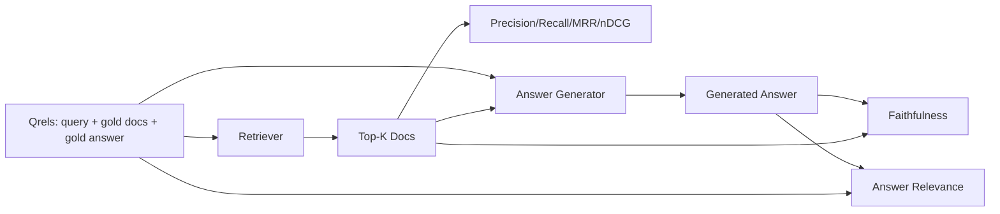

# 根据该报告的数据,该报告的数据和数据的数据均为:

> 如果您不能同时评分您的检索和答案,则您无法运输系统. 这两种方法不是相同的指标,并且相同的提示在不同的轴上失败.

**Type:** Build
**Languages:** Python
**Prerequisites:** Phase 11 lessons 06 (RAG), 10 (evaluation); Phase 19 Track B foundations (lessons 20-29); Phase 19 lessons 64, 65, 66, 67
**Time:** ~90 minutes

## 学习目标
- 从金中计算四个取取值指标:精度@k,回忆@k,MRR (平均交互级别) 和nDCG@k.
- 计算两个答案等级指标:信实性 (每个索赔都是基于检索的背景) 和答案相关性 (答案解决问题).
- 建立一个固定 qrels 文件 (查询,黄金文件标识,黄金答复文本) 评估读到端到端.
- 读取测量值,以诊断管道失败的地方:检索,排名,生成或定位.

## 问题

没有每一个阶段的指标,你会飞得盲目. 没有每一个阶段的指标,你会飞得盲目.

用户报告错误的答案.这是因为克削减了答案跨度吗?这是因为回收器没有包括克上层的克吗?是因为重排器推了右克过去的位置一?是因为发电机忽视了克并发明了什么东西吗?你不能从答案中说出来.你需要:

- 检索仪表将检索仪表的结果进行评分.
- 排名指标,以分级,正确的部分坐落在顺序.
- 为了评分发电机是否留在检索的文本中.
- 答案是否符合问题的相关性.

在本课程中,所有六个课程都建立在一个固定的qrels文件上. 评估是离线和确定性的; 在制作中,你将假的法官作为法官换成一个真实的.

## 概念



### 精准@k

如果金子有三份文件,而金子3份返回其中两个文件,而一个是错误的,精度@3是2/3.当不相关的检索件的成本高时,使用精度 (发电机浪费代币,或该件毒解答).

### 提醒

如果金子有三个文件,而五号包含三个文件, recall@5是1.0.当错过答案的成本高时,使用 recall (你宁愿看到一个额外的错误部分,而不是完全错过答案部分).

在生产中,人们通常引用的标准是 recall@k.

### 平均相应等级

对于每个查询,在排名列表中找到第一个相关文档的位置. 相互排名为1/位置. 在查询集中平均. MRR是检索器如何把最佳答案放在顶部的单数总结.

MRR 重量重于位置-1.一个查询中黄金文档处于排名1的贡献1.0.排名2的贡献0.5.排名10的贡献0.1.表格由列表的顶部占主导地位.

### 其他类型

标准化折扣累计收益.完整公式将每份获取的文件分配到收益 (通常是相关的1个,不相关的0个),按位置日志折扣,总和和 divides 理想的DCG (如果您排名完美的话,您将获得的DCG).范围从0到1.

nDCG可以满足分类相关性:金字母可以说"doc A 是 3,doc B 是 2,doc C 是 1".MRR 和 recall@k 将所有内容平坦成二进制.使用 nDCG 当每次查询中有多个部分相关的文档时.

### 忠诚

对于生成答案中的每个索赔,请检查索索赔是否支持被检索的文本.标准实施使用一个LLM作为法官提示,接收 (索赔,文本) 并返回是否.

忠诚度捕获生成器故障模式,模型发明内容.即使检索器返回了正确的块,一个产生幻觉的生成器就会被破坏.忠诚度也被称为基地,支持,归因.

在本课程中,我们使用一个确定性假设法官来实现忠诚度,该法官检查每个索赔的代币是否通过门覆盖检索的文本.在生产中,你会换成一个真实模型调用.

### 答案的相关性

忠诚性问"答案是否基于文本?"答案相关性问"答案是否基于问题?"一个忠诚但不涉及主题的答案在信任度上高,而在相关性上低.一个忽略文本的短短暂,主题上的答案在相关性上高,而在信任度上低.

标准实施还使用LLM作为法官:接受 (问题,答案) 并问答是否解决问题. 这一课实行了一个代币重叠加法官的替代.

## 固定式

```python
{
  "qid": "q1",
  "query": "what is the abort threshold for multipart uploads",
  "gold_doc_ids": ["d1", "d3"],
  "gold_answer_substring": "three failed parts",
  "graded_relevance": {"d1": 3, "d3": 2},
}
```

每个查询都包含:
- 查询链,
- 一组黄金文件 (准确/召回/MRR)
- 标准性相关性指令 (对于nDCG),
- 黄金答案字符串 (每个字符串的参考元数据被保留;本课程的忠实性是通过根据检索的文本来判断提取的索赔,而不是对此字符串来计算).

在生产中,你标签这些. 这堂课将手工制造的装置发送,

```figure
ci-rag-metric-ladder
```

## 建立它

`code/main.py`执行:

- `precision_at_k(retrieved, gold, k)`- - 字面上定义.
- `recall_at_k(retrieved, gold, k)`- - 字面上定义.
- `mean_reciprocal_rank(retrieved_list_of_lists, gold_list)`- - 关于查询的恶意.
- `ndcg_at_k(retrieved, graded_relevance, k)`- 双向或分别增长的DCG/IDCG.
- `extract_claims(answer)`- 分开答案成句子形状的索赔.
- `faithfulness(claims, context_texts, judge)`- 据裁定支持的索赔的比例.
- `answer_relevance(question, answer, judge)`- 判断答案是否符合问题.
- `MockJudge`确定性标志重叠判断,所以评估运行离线.
- `evaluate_pipeline(pipeline_fn, qrels, ks)`- - 管家,他运行了每一个指标.
- 测试试将三个管道变体 (chunker基线,混合检索,混合+重排) 运行到qrels上,并打印一个指标表.

运行它:

```bash
python3 code/main.py
```

输出显示了单个指标表中的每个变体的精度@k,回调@k,MRR,nDCG@k,忠实性和答案相关性.混合检索行超过回调时的重点线;重排行行超过MRR上的混合.

## 阅读测量数据来诊断失败

| Symptom | Likely cause | What to fix |
|---------|-------------|-------------|
| Low recall@k, low precision@k | Chunker cut the answer or retriever cannot find it | Chunker boundaries (lesson 64) or retriever modality (lesson 65) |
| Decent recall@k, low MRR | Right chunk is in top-k but not at position 1 | Reranker (lesson 66) |
| High MRR, low faithfulness | Generator invents content despite right context | Generation prompt; force-cite-or-refuse |
| High faithfulness, low relevance | Answer is grounded but off-topic | Query rewriter (lesson 67) or generation prompt |
| All four high, users still complain | Eval set is unrepresentative | Expand qrels with real user queries |

## 失败模式的演示将隐藏

**LLM-as-judge bias.**模型判断自己的输出比其更忠实. 用不同的模型家族来判断,

**Qrels rot.**随着体积的变化,黄金答案漂移.在2024年1月份为Q1的文件不再是正确的答案,因为团队将该函数更名.

**Faithfulness micro-checks miss macro-claims.**总体答案结构误导性时,每句话的忠诚性可以通过.

**Recall@k masks per-query failures.**平均回忆率90%可以隐藏一个查询类总是错过.按查询类 (字面,句子,多主题) 切割qrels,并每片报告.

## 用它

生产模式:

- 运行每一个检索器或发电机的变化. 处理回调@k 像测试失败.
- 继续按每一个查询的指标. 当用户抱怨时,请查看匹配的qrels条目,看看它是否被抓住.
- 排列的数量:一个由20个查询组成的烟集,运行在CI中;一个每晚运行的回归集200个;一个每周运行的深层集2000个.

## 运送它

课程69将整个管道线 (机,检索机,重排机,发电机) 线程,并对付端到端系统进行评估.

## 运动

1. 添加第五个检索指标:hit-rate@k. 与 recall@k. 解释它们不同时.
2. 执行一个级别的忠诚度:0 (不支持),1 (部分支持),2 (完全支持). 根据此更新指标.
3. 测量假设法官和真实法官之间的不一致性.
4. 添加查询类分片 ("字面","句子","多主题"). 报告每分片的指标.
5. 添加一个"答案长度"的指标,并将其与忠诚度相对.

## 关键词

| Term | What people say | What it actually means |
|------|-----------------|------------------------|
| Precision@k | "Hit rate over retrieved" | Fraction of top-k that are gold |
| Recall@k | "Hit rate over gold" | Fraction of gold in top-k |
| MRR | "First-hit position" | Mean of 1 / rank of first relevant document |
| nDCG@k | "Graded ranking quality" | DCG over the top-k divided by ideal DCG |
| Faithfulness | "Groundedness" | Fraction of answer claims supported by retrieved context |
| Answer relevance | "Did it address the question?" | Whether the answer matches the question's intent |
| Qrels | "Gold labels" | The labeled set of queries and their gold documents and answers |

## 进一步阅读

- 布克利,沃尔希斯, "评估评估措施稳定性"SIGIR 2000 - 排名指标的经典论文
- 瑞林,凯卡莱宁, "基于收益的 IR 技术的累计评估" - nDCG论文
- [Ragas: Automated Evaluation of RAG Pipelines](https://docs.ragas.io)
- [Anthropic, Evaluating RAG](https://www.anthropic.com/news/evaluating-rag)
- 第十课 - 评估框架基础
- 第19阶段课程 64-67 - 在这里评估的组件
- 第19阶段课程69 - - 这项评估成绩的端到端管道
