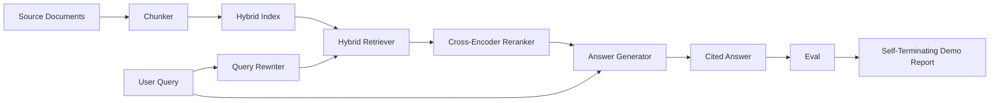

# 终端到终端的RAG系统

> 六个组件课程,一个管道,一个评估循环,一个自动终结的演示.这是你发送的系统.

**Type:** Build
**Languages:** Python
**Prerequisites:** Phase 11 lessons 06 (RAG), 10 (evaluation); Phase 19 Track B foundations (lessons 20-29); Phase 19 lessons 64, 65, 66, 67, 68
**Time:** ~90 minutes

## 学习目标
- 组建一个单个端到端管道,
- 执行一个答案生成器, 引用其要求的断片, 拒绝对低信心的回归.
- 通过对合组管道进行第68课程评估, 证明每个测量量量度的阶段构建在同一组件上单独获胜.
- 建立一个自动终结的CLI演示,它吞了一个固定器件,运行一个固定查询集,并以总结报告离开零.

## 问题

六个单独的组件都没有证明任何事. 克可以在回忆@5上赢得对象,而在系统回忆@5上输掉,因为回收器无法排名克所发射的东西. 重新排名器可以在合成候选人池上提升MRR,而在真正的双编码候选人上失败,因为重新排名预算中的双编码者召回量太低. 查询重写器可以在一个查询上推广黄金文档,然后在下一个查询上打破,因为LLM模拟返回了退化假设.

整合测试是整个管道的终端运行,与相同的固定式,同样的测量,一个管弦器文件,将所有东西连接在一起.这就是这个课程的构建.如果整合管道的测量量超过每个阶段的单独演示的测量,你已经证明了系统.

## 概念



### 电缆选择

管道是一个小图,每个阶段都是一个有明确的签名的函数.

| Stage | Input | Output |
|-------|-------|--------|
| Chunker | Document text | List of Chunk records |
| Retriever | Query string | Top-N Chunk records |
| Rewriter (optional) | Query string | List of rewrites + hypothetical |
| Reranker | Query, candidates | Top-K Chunk records with cross scores |
| Generator | Query, top-K Chunk records | Answer string with citations |

只有一个字符,每一个字符都稳定.`Pipeline`课程包含五个阶段,`query`每个阶段都可交换:通过不同的器,检索器,重写器,重排器或发电机,

### 答案生成器

课程中,一个决定性模拟生成器:

1. 取了K级重排的部分.
2. 选择最多两个部分,其文本包含最高内容标记与查询重叠.
3. 发出一个答案,是从每一个选定的部分中连接一个句子,每个句子都会被一个句子所接下来.`[doc_id:chunk_index]`着.
4. 如果没有一块超过垃圾门,则发出"我不知道"没有引用.

在制作中,你用提示模板换取真实LLM电话:

```
You are answering a question using only the snippets below.
Cite every claim with the anchor in parentheses.
If the snippets do not answer the question, say "I do not know".

Question: {query}

Snippets:
{enumerated chunks with anchors}

Answer:
```

拒绝对低信心的路径是跨编码器级-1分数记录的全部原因.如果它位于体积门以下,发电机拒绝.这是对幻觉答案的安全门.

### 自我灭绝的演示

演示程序运行一切,以结束.它打印一个查询的阶段分类,运行四个固定式 qrels的 eval,打印一个指标表,如果所有课程68指标都符合演示中设定的门值,则出局状态为零.如果任何指标都低于门值,则演示程序将以非零状态和一个命名失败指标的消息出局.

通过测试,我们可以看到一个测试的结果, 测试的结果是这样的. 测试的结果是这样的. 测试的结果是快速的,快速的,决定性的. 值是故意紧张的,

```figure
rag-pipeline-flow
```

## 建立它

`code/main.py`执行:

- `Chunk`- 经过所有阶段进行的记录 (通过一个chunk_index和源doc_id扩展了第64课的形状).
- `Chunker`-从第64课中选择一个策略 (默认递归分区).
- `HybridIndex`- 课65的BM25+密集+RRF包.
- `Rewriter`(可选) - 选择一个HyDE,多查询,按查询长度和连接存在,从67课程分解.
- `Reranker`- 训练有素的交叉编码器,从第66课中,具有较小的固定训练集,
- `Generator`- 具有引用和低信心的决定性假设生成器.
- `Pipeline`- 组建五个阶段`query(question)`返回方法`Result(answer, top_k, latency_ms_per_stage)`现在,我们要去.
- `run_demo()`- 摄入体积,执行三个固定查询,执行评估,打印结果,按门设置出口代码.

运行它:

```bash
python3 code/main.py
```

输出是打印一个查询痕迹,完整的评估表,以及最后的通过/失败状态. 返回出口代码0在固定.

## 失败模式的演示将隐藏

**Chunker boundary drift.**如果您在 eval qrels标签通过和演示中交换了 chunker 策略,黄金文档ID不再排列. 锁定了 chunker 策略在 qrels 文件中.演示包含一个标题,以标题的 chunker.

**Reranker training set leaks into the eval.**在课66中,14个训练三重中包含类似于评估查询的查询.在制作中,严格地进行评估查询.演示的评估查询是故意与重排训练集分离的.

**Mock generator hides hallucination risk.**假冒不能幻觉,因为它只发出来自检索的部分的文字.

**No streaming.**管道在每个阶段结束时返回完整的答案.一个生产系统将流出发电机的输出.流出是不适用的;答案级的指标在最后的字符串上无论是如何工作.

**Latency is offline.**假 LLM 电话是持续时间.真正的 LLM 电话占主导地位. 在请求范围内规划延迟预算;课程的每个阶段时间仅仅衡量CPU工作.

## 用它

生产模式:

- 通过一个管道导体,将管道文件运送到一个管道导体下,并使用明确的舞台接口.
- 如果评估下降, 合并不会降落.
- 按CI运行的指标追踪保持,以便您可以将回归归归因于阶段交换.
- 加入一个由20个查询 (回归集的子集) 组成的烟集,该集在30秒内运行;全回归集每晚运行.

## 运送它

在本课程中,管道文件是19期F轨道课程的其他部分课程所承受的形状.随后的课程将增加摄入自动化,增量重新索引,远程测量和服务层.查询,重新排名,重写和评估的部分在这里完成.

## 运动

1. 在重写器内添加一个每查询策略选择器:从67课中 (长度,连接,语法比) 选择HyDE,多查询或分解.
2. 加入一个真正的LLM电话来发电机后面的 env旗. 默认的模拟. 测量延迟三角形.
3. 扩展演示,以进行一个`--corpus path`检查和值检查.
4. 添加一个`--strategy`测量每个战略对端到端召回的贡献.
5. 添加一个流通生成器接口,然后将其输入到 eval 中. 确认信任是计算在最后的字符串上,而不是在流通的前.

## 关键词

| Term | What people say | What it actually means |
|------|-----------------|------------------------|
| Pipeline | "RAG pipeline" | The composed stages from ingestion to cited answer |
| Citation anchor | "Source link" | The (doc_id, chunk_index) reference attached to each claim |
| Refuse-on-low-confidence | "I do not know" | Generator returns no answer when the reranker top-1 score sits below threshold |
| Smoke set | "CI eval" | The minimal qrels subset that runs in every PR check |
| Stage interface | "Function signature" | The stable input and output type of each pipeline stage |

## 进一步阅读

- [Anthropic, Building search and retrieval](https://www.anthropic.com/news/contextual-retrieval)
- [Pinterest, MCP internal search](https://medium.com/pinterest-engineering)- 参考生产架构
- [Ragas: Automated Evaluation of RAG Pipelines](https://docs.ragas.io)
- 第十一阶段第六课 - RAG基本面
- 第19阶段课程 64-68 - - 这里所组成的组件
