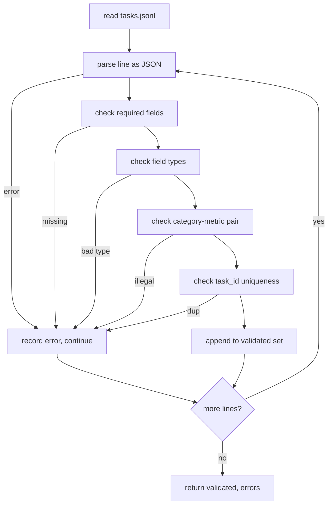

# 任务规格格式

> 评估工具只能像合同任务一样有效. 在写一个分数函数之前,冷JSONL形状和计量词汇.

**Type:** Build
**Languages:** Python
**Prerequisites:** Phase 19 Track B foundations
**Time:** ~90 min

## 学习目标

- 定义一个包含算术,多选项,代码执行,分类和单形自由文本总结的JSONL任务记录方案.
- 关闭一个密码名字词汇,以便下游课 (71-73) 可以在一个领域发送.
- 指定一些拍摄的例子和后处理规则作为任务的一部分,而不是运行者,因此相同的提示在模型中产生相同的目标.
- 执行一个严格的验证器, 拒绝错误记录,
- 发送一个10任务的配件组, 运行规格的每个分支,

```figure
ci-task-spec-gate
```

## 为什么冷的标本

一个研究代码库会积累评估脚本比测试积累更快.六个月后,每个笔记本都有自己的JSON形状,每个指标都被重新实现了两次,并且没有什么可以在运行中比较.修复是无聊的.选择一个方案.写一个验证器.拒绝其他一切.这就是这个课程所做的.

形状借鉴了来自大板,HELM和lm-eval风格的带,但场地名称是我们的.每个场地都有一个主人.跑者读取任务.测量器读取目标.后工艺步骤正常化了生成.没有场地是可变的中管线.

## 记录形状

任务是一个单行JSON对象.`tasks.jsonl`坏行取消了记录,而不是运行.

```json
{
  "task_id": "arith_001",
  "category": "arithmetic",
  "prompt": "Compute the result. Question: 17 + 24\nAnswer:",
  "targets": ["41"],
  "metric_name": "exact_match",
  "few_shot_examples": [
    {"prompt": "Question: 2 + 2\nAnswer:", "completion": "4"}
  ],
  "post_process": "strip_whitespace",
  "metadata": {"difficulty": "easy"}
}
```

要求的领域是`task_id`现在`category`现在`prompt`现在`targets`现在`metric_name`现在`post_process`现在,我们要去.`few_shot_examples`其他`metadata`无知的顶级字段未能验证.

## 领域规则

`task_id`验证器将文件的独特性强制执行.

`category`是一个`arithmetic`现在`mcq`现在`code_exec`现在`classification`现在`summary`类别限制了哪个计量和后处理对是合法的.`code_exec`任务必须使用`metric_name = code_exec`其他`mcq`任务必须使用`metric_name = exact_match`针对一个单字母的目标.

`prompt`验证器禁止后续白空间,并且拒绝已经包含一些弹的区块的记录.

`targets`是一个不空的字符串列表.`exact_match`任何相匹配的元素都会被计算出来.`f1`其他`rouge_l`获得最高分的目标赢得了.`mcq`列表包含一个元素.

`metric_name`是一个`exact_match`现在`f1`现在`bleu_4`现在`rouge_l`现在`accuracy`现在`code_exec`词汇库关闭,一个新的指标需要一个新的课程和一个新的入口.

`few_shot_examples`是一个列表`{prompt, completion}`验证器将列表封闭在8个条目,以保持提示的边界.

`post_process`是一个`none`现在`strip_whitespace`现在`lower`现在`extract_letter`现在`extract_code_block`现在`extract_first_line`每个规则都有一个单独的确定性行为.验证者禁止结合规则.

## 验证器行为



验证器返回两个列表:验证记录和错误记录,违反行,违反规则和错误字段.如果错误列表不空,运行者拒绝启动,除非明确`--allow-bad-tasks`旗已经设置.

## 短拍的转载

运行者将一些拍摄的例子连接到提示前,用空行分离器.每个模型都运行相同的代码路径,因此唯一的差异来源是模型本身.作者每一个提供商都会写一次,而不是一次.

```python
def render(task):
    parts = []
    for ex in task.get("few_shot_examples", []):
        parts.append(ex["prompt"] + " " + ex["completion"])
    parts.append(task["prompt"])
    return "\n\n".join(parts)
```

## 后处理规则

后流程步骤是次世代,是次数前的.

- `none`返回链接没有变化.
- `strip_whitespace`带领和后续的白色空间.
- `lower`下了弦.
- `extract_letter`返回匹配的第一个字符`[A-E]`用于 MCQ.
- `extract_code_block`返回用于代码执行的第一个三杆后围块的体体.
- `extract_first_line`返回用于总结分类的第一个非空行.

需要一个规则的任务属于新课程.

## 这一课不做什么

没有得分,没有调用模型,没有运行代码.这些都在71,72和75课中.

验证器传递所有10项. 单独的固定器 (`tasks_bad.jsonl`) 打开每一个规则,验证器返回了完全相同的错误.

## 如何读取代码

`main.py`定义`TaskSpec`现在`validate_task`现在`validate_file`设备装载器是`load_fixtures`染和后处理辅助器在验证旁边,所以第75课的运行者进口了单个模块.

阅读`main.py`读一读.`code/tests/test_spec.py`测试标记了每个验证规则和后流程行为.`main.py`验证捆绑的装置并打印总结.

## 走得更远

实际的评估套件就像计划一样增长列列的类别.清醒的举动是拒绝添加一个类别,而不添加一个指标,一个后过程规则和至少一个固定任务.把规格看作数据库迁移.每个变化都会被审查,版本化,并伴随着测试.本课中的验证器是门户.
