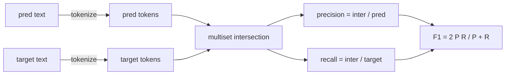
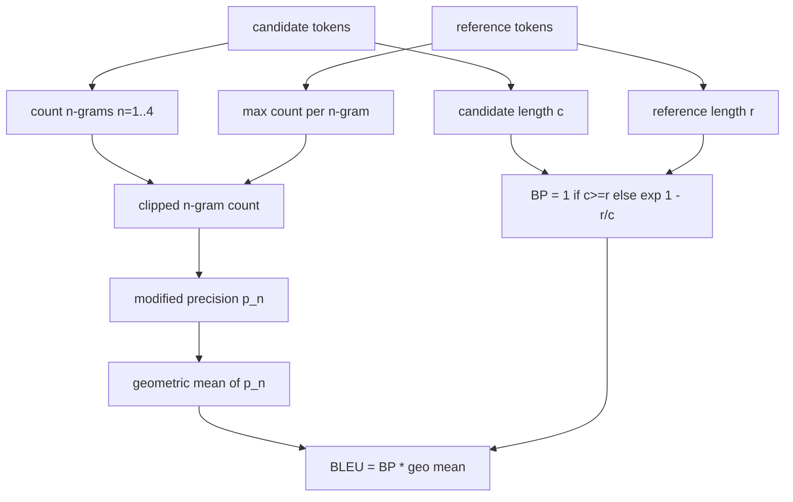

# 经典指标

> 蓝色,红色,F1,精确匹配,精确性.五个指标仍然占据了大多数发表的LLM评估数字.从第一原则实施每个,这样你知道数字意味着什么.

**Type:** Build
**Languages:** Python
**Prerequisites:** Phase 19 Track B foundations, lesson 70
**Time:** ~90 min

## 学习目标

- 实现令牌级别的精确匹配,F1和准确性,并遵守明确的令牌规则.
- 实现BLEU-4从头开始:修改的 n-gram精度, n 超过 n 的几何平均值等于 1 到 4,短暂处罚.
- 使用最长的常见次序,执行ROUGE-L,使用F-beta精度和召回组合.
- 通过第70课的 metric_name 字段,让跑步者保持了不了解测量.
- 通过从工作实例中取出的参考向量,而不是第三方图书馆,将行为固定.

```figure
cd-bleu-overlap
```

## 为什么重新实施

您将阅读报告BLEEU 28.3的论文,另一个报告BLEEU 0.283. 两本图书馆之间,你会发现ROUGE-L分数差异10分,因为一个分数缩小到小字母,而另一个分数没有. 最快的方法是自己写出指标,然后指向标记器决定的行线和滑滑的行线. 之后,在文件中比较数字成为阅读标准设置的问题,而不是争论图书馆.

蓝色是计算和.红色是动态编程.F1是代币的交叉路口.最困难的部分是选择代币和承诺它.

## 标记

标记器是`re.findall(r"\w+", text.lower())`微字,字母数,字母分数,字母分数.这个课程中的每个指标都使用了这个标记符号. 运行者没有选择.如果你换代码符号,你会运行一个不同的基准.

```python
TOKEN_RE = re.compile(r"\w+", re.UNICODE)
def tokenize(text):
    return TOKEN_RE.findall(text.lower())
```

产品设置将关心CJK,缩写和代码识别器.课程的重点是,代币化器是合同,而不是一个按.

## 完全匹配

```python
def exact_match(pred, targets):
    return float(any(pred.strip() == t.strip() for t in targets))
```

它每项任务返回1.0或0.0. 数据集中的总数是平均值.这是算术,MCQ和短分类任务的工作马.

## 代币级 F1

设置预测和目标的代币多组.精度是预测的多组分为预测的多组分.回忆是目标的多组分为相同的交叉.F1是和平均值.实现处理空预测和空目标边缘情况.



对于多目标任务,我们将最好的F1取出目标清单上. 这与SQuAD类型的行为相匹配.

## 蓝色-4

蓝色是正规的机器翻译指标,它仍然在总结工作中出现.我们使用的公式是体积水平的蓝色4 (BLEU-4) 标准短暂处罚和添加-一平滑在修改的n-gram数量上,因此一个缺失的4gram不会推到零的分数.

对于每个候选人参考对,我们计算了修改的 n-gram精度为 n等于 1, 2, 3, 4.修改的精度剪辑了候选人 n-gram的数量最大数量 n-gram在任何参考,因此一个候选人不能通过重复一个句子膨胀.四个精度的几何平均被简短处罚包裹.



顺规则是林和奥赫所谓的方法1:在取日记之前,在每个 n-克的精度中,加一个数量和命名器.`log 0`如果一个参考没有相匹配的4克,并且接近长期候选人的不平衡值.

## 红色

红色-L比较了候选和参考代币序列的最长常见次序.LCS捕获了单词顺序,而不会强加连续性,这就是为什么它是默认的总结度.我们使用标准动态编程表计算LCS长度,然后将回忆取出为`lcs / reference length`精度如`lcs / candidate length`并且与F-beta结合,在Beta等于对称F1形式的Beta等于1

```python
def lcs_length(a, b):
    n, m = len(a), len(b)
    dp = numpy.zeros((n + 1, m + 1), dtype=int)
    for i in range(n):
        for j in range(m):
            if a[i] == b[j]:
                dp[i+1, j+1] = dp[i, j] + 1
            else:
                dp[i+1, j+1] = max(dp[i+1, j], dp[i, j+1])
    return int(dp[n, m])
```

编号表使实现可读;纯 Python 列表也会工作.选择 ROUGE-L 的任务支付每项任务的 O(n m) 成本.对于典型的总结长度保持在毫秒以下.

## 准确性

对于多目标分类任务,准确度降低到与单个标准化目标的完全匹配. 我们将其作为一个独立的功能,`metric_name`没有在跑者内部进行串串比较.

## 发送合同

唯一的入口点是`score(metric_name, prediction, targets)`它回来了漂浮的.`[0, 1]`跑步者不会分类为测量名称.它将电话放弃并写出结果.这是第75课将粘贴到第70课任务规范的表面.

```python
def score(metric_name, pred, targets):
    if metric_name == "exact_match":
        return exact_match(pred, targets)
    if metric_name == "f1":
        return max(f1_score(pred, t) for t in targets)
    if metric_name == "bleu_4":
        return max(bleu4(pred, t) for t in targets)
    if metric_name == "rouge_l":
        return max(rouge_l(pred, t) for t in targets)
    if metric_name == "accuracy":
        return accuracy(pred, targets)
    raise ValueError(f"unknown metric_name: {metric_name}")
```

`code_exec`在第72课中处理,然后把它放进发射器中.

## 这一课不做什么

它不调用模型. 它不会将后流程规则70课程已经做的事情超越的几代人进行正常化. 它不计算信任间隔. 它不做BLEURT或BERTScore (他们需要模型,生活在不同的课程中). 问题是层面:五个指标,一个代币,一个发送表.

## 如何读取代码

`main.py`根据标准的定义,每个指标是自由函数加上发射器.`_reference_examples`测试中,测试器使用了8个例子,并打印了每次测量分数.`code/tests/test_metrics.py`点参考向量,并强调每个边缘情况 (空预测,空引用,没有共享的代币,精确匹配,重复短语剪辑).

阅读`main.py`函数按复杂性排序.精确_匹配和精度是每行一个线.F1是六行.BLEU和ROUGE-L是重部件,它们包含对平滑规则和LCS复发的详细评论.

## 走得更远

经典指标是必要的,不够的.它们奖励表面重叠和错失意义.解决方案是将基于模型的指标层放在顶部 (BLEURT,BERTScore,GEval) 一旦你信任了经典的地板.这是一个后来的课程.现在:让这五个工作,用测试结它们,你有一个可审计,快速和可复制的指标堆.
