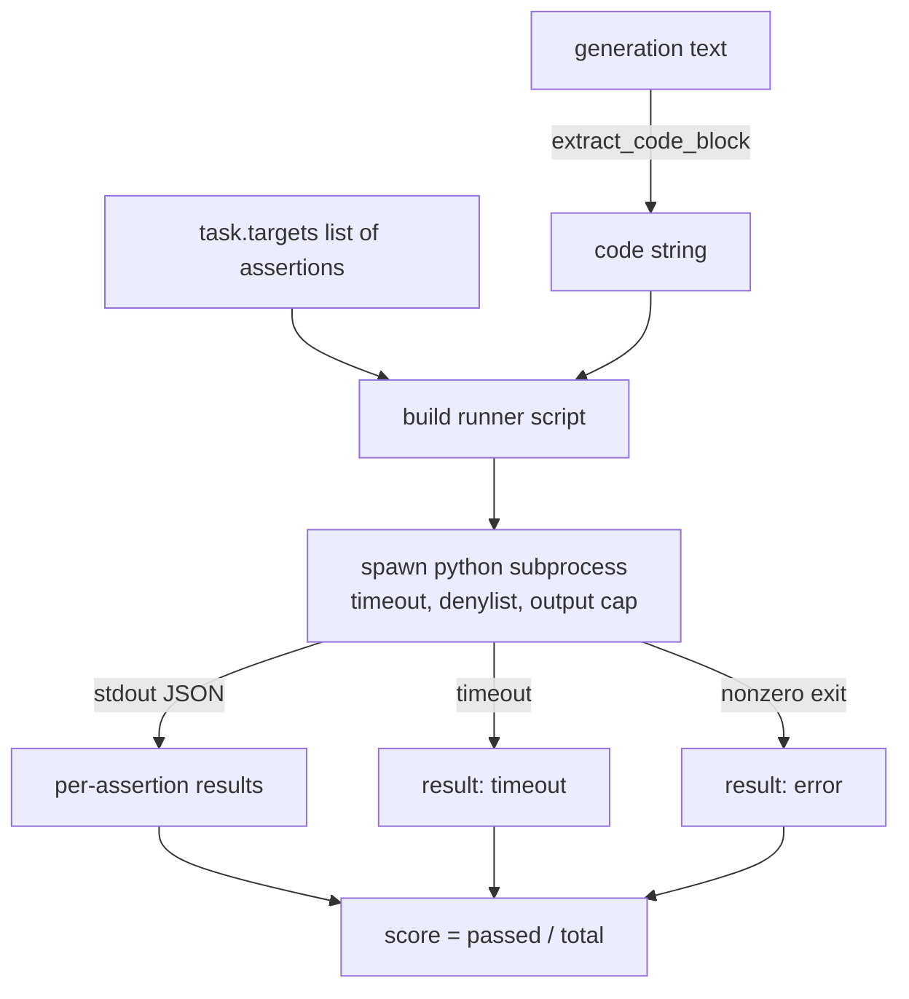
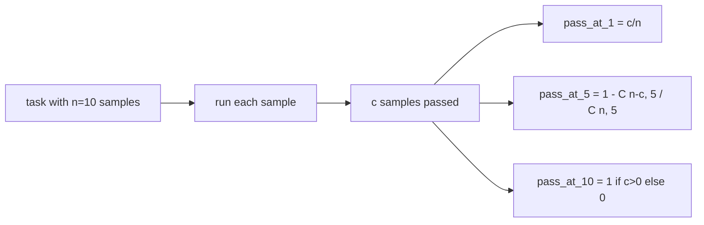

# 代码执行量表

> 通过测试,生成的代码是正确的. 评估带必须提取代码,运行它而不撞击主机,并诚实地计算通过率. 这一课构建了表面.

**Type:** Build
**Languages:** Python
**Prerequisites:** Phase 19 Track B foundations, lessons 70 and 71
**Time:** ~90 min

## 学习目标

- 通过与课70后过程规则相匹配的方式从自由形式生成中提取代码块.
- 执行候选代码在一个孤立的子进程中,具有墙钟时间限,输出盖和进口列表.
- 作为提供的断言字符串的分数,将任务分为对候选人的分数.
- 计算一个模型中多个代人的任务的pass-at-k.
- 处理沙箱崩,语法错误和时间切断作为第一级失败模式,运行者可以登录的出口代码.

```figure
sandbox-runner
```

## 为什么一个孤立的子工艺

排列中的`exec`造成安全和稳定危险.`while True: pass`永远阻止了评估.`import shutil; shutil.rmtree('/')`解决方案是产生一个新的Python解释器,通过代码到Stdin,写出声明结果到Stdout,然后杀死该过程,如果它超越.主机评估过程继续运行.

实际的评估,如HumanEval,MBPP,BigCodeBench和LiveCodeBench都使用一个子进程沙箱.上面有一层Docker.我们停下来处理这个子进程的原因是:它便携式,它是stdlib,它捕获了对教育评估重要的故障模式.生产部署增加了Seccomp,网络隔离和只读取文件系统.下一个关于硬化生活的课程是除了这条轨道之外.

## 执行代码任务的形状

`code_exec`任务包含了声明字符串`targets`运行者从该代码中提取一个围的代码块,围绕它建立一个测试圈,然后运行结果.



结果是中小部分`[0, 1]`运行者无论失败如何都会返回相同的形状:子进程崩都会被映射到一个正常化的错误代码,而不是一个到带的Python追踪.

## 丹尼尔斯

在运行候选码之前,运行脚本将危险模块的进口重写到一个子上`ImportError("denied")`清单是故意保守的:`os.system`现在`subprocess`现在`socket`现在`requests`现在`urllib`现在`urllib.request`现在`urllib.error`现在`urllib.parse`现在`ctypes`现在`shutil`现在`http.client`现在`asyncio.subprocess`现在,我们要去.

我们不假装这是弹药性. 确定对抗代码可以逃脱任何在过程中的沙盒在Python. 丹尼尔列表是一个后备. 墙钟时间和输出盖是承载控制.

```python
DENIED = {
    "os.system": True,
    "subprocess": True,
    "socket": True,
    "shutil": True,
    "requests": True,
    "urllib": True,
    "ctypes": True,
}
```

我们将候选人包装成预期.`import sys`一个子的守护者.`os.system`现在我们可以提升.`main.py`现在,我们要去.

## 时间限制

每个子进程都会得到3秒的默认预算.`subprocess.run(..., timeout=t)`如果时间停止,跑者会抓住`TimeoutExpired`杀死过程,记录一个`timeout`运行者继续前进,运行者继续前进.

时间间隔可根据任务配置到`task.metadata.timeout_s`长期的单元测试可能要求更多;课70的验证器将值限制在30秒,以保持套件的限制.

## 输出盖

运行过程可以淹没工作室,使主机内存疲.运行员将工作室输入缓冲器,一旦运行总数超过256 KB,就会杀死孩子.结果记录为`exit_code = error`随着细节链`"output overflow"`实际上,一代人会意外地写出一个印发的无限循环.

## 通过-在-k

通过-at-k是HumanEval和朋友使用的无偏见估计器.`n`独立的任务样本`c`通过它们的概率,`k`其他`n`含有至少一个可通过的溶液:

```
pass_at_k(n, c, k) = 1 - C(n - c, k) / C(n, k)
```

什么时候`n - c < k`值是 值是 值是`1`执行直接处理边缘案例.`pass_at_k(n, c, k)`对于第74课中的排名板层来说.



## 退出码

跑者每项任务中返回五个结果之一:

- `pass`当一切说法都过去了的时候.
- `assertion_fail`没有任何证据.
- `syntax_error`当代码没有进口或出现语法错误时.
- `timeout`当墙上的钟表过期.
- `error`其他任何撞击,包括列击和输出过度 (详细的过度过度表面)`"output overflow"`)

结果仍然是小部分. 出口代码是元数据. 下游课程可以决定是否计算时间作为零或缺失数据.

## 这一课不做什么

它不会给你一个真正的沙盒.它不会从开放的网上运行不可信赖的代码.它不会处理文件I/O或网络调用等状态任务.这些需要容器或微VM.本课程的重点是合同:一个孤立的子进程,一个代码列表,一个时间限,一个输出盖,一个清洁的出口代码词汇和通过k数学.

## 如何读取代码

`main.py`定义`extract_code`现在`run_candidate`现在`score_code_exec`其他`pass_at_k`字符串的脚本是构建成字符串,然后通过为`-c`通过一个新的Python解释器.`code/tests/test_exec.py`根据HumanEval风格的工作示例,使用四个出口代码加上pass-at-k.

阅读`main.py`运行模板是承载的部分. 着断循环,直到你可以预测它将写回母进程的JSON包裹.

## 走得更远

接下来,我们需要解决问题. 不同 Python 版本在 Windows 上处理 SIGKILL 不同. 最好的解决方案是把跑步者放入Docker图像中. 接下来是用真实单位测试文件取代断言字符串,以便评估与生产CI的匹配. 现在就不要叫断言弦测试了,因为它们是玩具测试,
