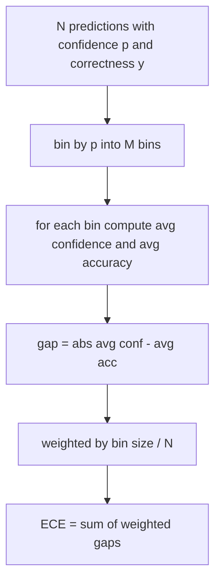
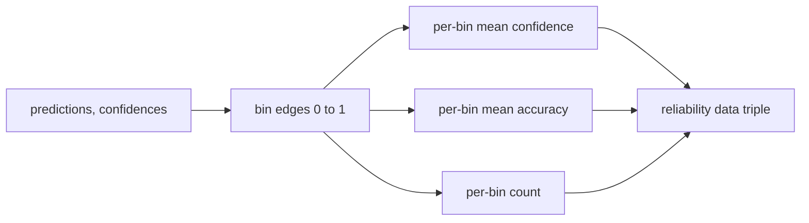

# 困惑和校准

> 如果你的模型说90%对千个答案有信心,但得到六百个答案是正确的,那么它并不是很好的校准.校准是值得信赖的评估的一半.另一半是困惑,这告诉你模型是否认为被保留的文本是可信的.

**Type:** Build
**Languages:** Python
**Prerequisites:** Phase 19 Track B foundations, lessons 70 and 71
**Time:** ~90 min

## 学习目标

- 根据模型适配器提供的代币负日志概率计算在持久的体积上代币水平的困难.
- 根据预测概率计算分类器或多选项评估的预期校准错误 (ECE).
- 计算Brier分数 (与正确度指标的平均平方错误) 并解释它何时执行 ECE不执行的.
- 构建需要图表数据的可靠性图表,以绘制信任与准确度曲线.
- 把三个电线都放进了测试带,让跑者可以连接.`perplexity`现在`ece`其他`brier`模型报告的数字.

```figure
cd-reliability-diagram
```

## 什么让你感到困惑

乱率是每代币的指数平均负记本概率. 低点更好. 模特将一个概率分配给每一个实际代币. 词汇规模的困难意味着模型是统一的,没有学到任何东西. 实际数字在此之间:维基文字-103的强大的2026基模型在8到12左右. 差的相同的短信是50加.

带本身不计算日志概率.这些来自模型适配器.带总结:它采用每代币日志概率的列表,每序列的代币数量列表,并返回体积的困难.

```python
def perplexity(neg_log_probs, token_counts):
    total_nll = sum(neg_log_probs)
    total_tokens = sum(token_counts)
    return math.exp(total_nll / total_tokens)
```

实现处理零代币边缘情况并声称负记账概率是非负的.一个常见的错误是忘记否定:一个回归的适配器`log p`没有`-log p`函数将这作为违反合同.

## 欧洲经济委员会采取哪些措施

预期校准错误按它们对固定数量的桶的信心进行预测,然后根据桶大小进行权重,测量了对桶的信心和准确度之间的平均差距.



标准的配方使用了10个相同宽度的桶`[0, 1]`实现支持任何正数的数量.`bins`参数,以便跑步者可以选择出版公约 (10) 和比较公约 (15).

通过10个桶和100个预测,你无法区分0.02个桶与随机噪音. 实现将与ECE一起填充的桶数返回,因此跑者可以拒绝报告一个单个数字.

## 布里尔的成绩是什么?

欧洲经济指数 (ECE) 仅关心平均差距.一个对半个垃圾桶过度自信,对另一半过度自信的模型可以在局部度量度差的情况下具有低的欧洲经济指数.布里尔分数测量了正方误与每预测的真实结果,因此它直接处罚了传播.

对于二进制结果,Brier是`mean((p_i - y_i)^2)`运行员报告了规模表,但记录了仪表板的分解.

```python
def brier(p, y):
    return float(np.mean((p - y) ** 2))
```

## 可靠性图表数据

根据可靠性图表图,每个bin的图表预测了对实验准确性的信心.对角形是完美的校准.函数返回了三个阵列:每bin的平均信心,每bin的平均准确性和每bin的数量.图表代码生活下游;这个课程在数据形状上停止.



返回的图普是调用层需要绘制图表或计算自定义的ECE变量 (适应性ECE,扫描ECE等).我们返回了 numpy 阵列,因此下游代码不需要转换.

## 信心来源

带不假设信任来自 softmax. 它接受任何数值.`[0, 1]`对于多选择任务,自然的信心是`softmax over option log-likelihoods`对于自由文本来说,自然的信心是模型的自我报告概率或平均日志概率的指数值. 评估只是消耗了数字. 它来自于适配器的工作.

## 边缘盒子

- 所有预测都是错误的:ECE是平均信心,Brier是高的,困惑是模型对文本的想法.
- 所有预测都很准确:ECE接近零,Brier接近零.
- 完全不确定的预测器在p=0.5:ECE是0.5减小精度,Brier是0.25减小修正术语.
- 空输入:ECE,Brier和可靠性返回 `0.0`复杂性返回`NaN`没有一个路径发出警告;运行者检查值,决定是否报告或跳过.

实际的模型不会撞到它们,但一个车适配器或一个小样本会撞到它们,

## 发送

校准不是F1的每任务指标,而是每模型的报告.`(confidence, correct)`复杂性是通过一个保留的文本体积计算的,与任务分别的分分数分开.

接口是:

```python
report = CalibrationReport.from_predictions(confidences, correct)
report.ece          # float
report.brier        # float
report.reliability  # tuple of three numpy arrays
report.populated_bins  # int
```

`PerplexityResult.from_token_nll(neg_log_probs, token_counts)`返回每代币的复杂性和平均负记录概率.

## 这一课不做什么

它不调用模型.它不实现软max.它不估计输出代币的信心;这是适配器的工作.它不进行温度扩展或Platt扩展;这些是生活在不同的课程中的后期修正.本课程的目的是使三个数字 (,ECE,Brier) 值得信赖和可复制.

## 如何读取代码

`main.py`定义`perplexity`现在`expected_calibration_error`现在`brier_score`现在`reliability_diagram`其他`CalibrationReport`现在,`PerplexityResult`测试的基础是:一个精确的定位模型,一个过度自信的模型,一个不自信的模型.`code/tests/test_calibration.py`印每一个边缘外套加上合成预测器的参考值.

阅读`main.py`函数顺序是从上到下.函数顺序是从 skalar 到 vector 进行报告的.每个函数都有一个简短的 docstring,包括数学和合同.

## 走得更远

在公布的评估中,校准是最被忽视的轴心. 许多排名榜单都报告了一个准确数量, 通过测试,测试的结果是: 一旦设置了校准管道,将温度调度加到长期的验证片上,重新计算ECE, 这是一个单独的课程,但这里的 floor生活在这里.
