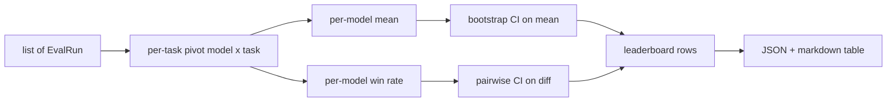
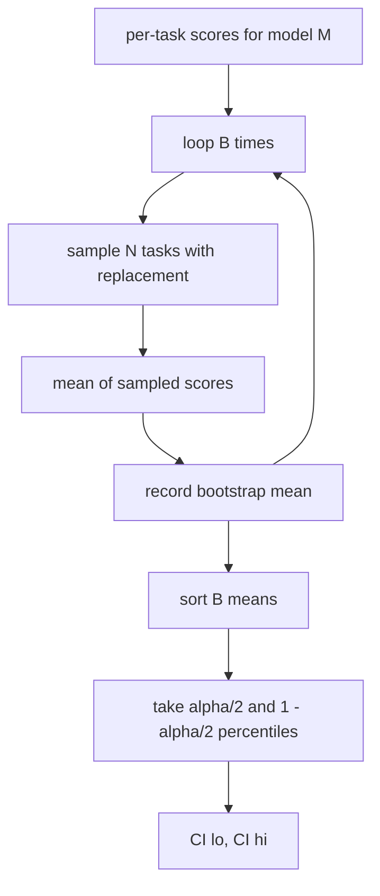

# 排名表的集成

> 根据一个模型,每项任务的分数很容易. 异质任务的模型排名更难. 在一千个预测排名表上的统计意义是每个人都跳过的部分. 这一课不会跳过.

**Type:** Build
**Languages:** Python
**Prerequisites:** Phase 19 Track B foundations, lessons 70, 71, 73
**Time:** ~90 min

## 学习目标

- 综合多个模型和多个任务的每个任务分数,以一个整齐的每个模型排行.
- 规范异质分数,以免通过率和蓝色EU值过度影响总数.
- 根据平均和胜利率排名模型,并解释每一个模型是什么时候合适的总结.
- 根据每款模型的平均分数和对差计算启动线的信心间隔.
- 输出排名表作为JSON报告,作为一个标记表,课程75中的运行者可以粘贴到CI评论中.

```figure
ci-leaderboard-ci
```

## 输入的形状

集成器使用了列表`EvalRun`记录:

```python
@dataclass
class EvalRun:
    model_id: str
    task_id: str
    metric_name: str
    score: float          # in [0, 1]
    category: str
```

课75中的跑者每次发射1枚记录`(model, task)`总结者不关心得分是如何产生的.`[0, 1]`现在,我们要去.

## 输出量

现在有三个桌子.



排名表排行包含: `model_id`现在`mean_score`现在`mean_ci_lo`现在`mean_ci_hi`现在`win_rate`现在`tasks_completed`其他选择性`categories`按类别平均的地图.

## 规范化

如果一个任务得到了分数`[0, 1]`另一个在`[0, 100]`总结器验证每个输入分数都在`[0, 1]`根据第71-13课程, 修改方法是: 修改方法, 修改方法, 修改方法, 修改方法, 修改方法, 修改方法, 修改方法, 修改方法, 修改方法, 修改方法, 修改方法, 修改方法, 修改方法, 修改方法, 修改方法, 修改方法, 修改方法, 修改方法, 修改方法, 修改方法, 修改方法, 修改方法, 修改方法, 修改方法, 修改方法, 修改方法, 修改方法, 修改方法, 修改方法, 修改方法, 修改方法, 修改方法, 修改方法, 修改方法, 修改方法, 修改方法, 修改方法, 修改方法, 修改方法, 修改方法, 修改方法, 修改方法, 修改方法, 修改方法, 修改方法, 修改方法, 修改方法, 修改方法, 修改方法, 修改方法, 修改方法, 修改方法, 修改方法, 修改方法, 修改方法, 修改方法, 修改方法, 修改方法, 修改方法, 修改方法, 修改方法, 修改方法, 修改方法, 修改方法, 修改方法, 修改方法, 修改方法, 修改方法, 修改方法, 修改方法, 修改方法, 修改方法, 修改方法, 修改方法, 修改方法, 修改方法, 修改方法, 修改方法, 修改方法, 修改方法, 修改方法, 修改方法, 修改方法, 修改方法, 修改方法, 修改方法, 修改方法, 修改方法, 修改方法, 修改方法, 修改方法, 修改方法, 修改方法, 修改方法, 修改方法, 修改方法, 修改方法, 修改方法, 修改方法,

## 平均和胜利率

两种排名方案都为不同的目标服务.

平均分数是一个模型的每项任务分数平均值.这是标题数排行榜报告.它对异常值和任务不平衡敏感.

胜率计算一个模型在同一任务上击败其他模型的频率.对于每个任务,最高分数的模型赢得 (结分).胜率等于赢得分数的任务.它对异常值和尺度差异不敏感,但损失信息.

```python
def win_rate(model_id, runs_by_task, all_models):
    wins, total = 0, 0
    for task_id, runs in runs_by_task.items():
        scores = {r.model_id: r.score for r in runs if r.model_id in all_models}
        if model_id not in scores:
            continue
        total += 1
        best = max(scores.values())
        if scores[model_id] >= best:
            wins += 1
    return wins / total if total else 0.0
```

杆报告了这两种情况. 第75课中的跑者按默认的平均排名;如果用户更喜欢,则胜率的倒标列就在这里.

## 启动带安全间隔

按模型的意思,以启动样本重新样本化任务计算的保证间隔. 我们重新样本化任务ID,计算重新样本化的集合的平均值,重复`B`按数分的时间,`alpha`现在,我们要去.



对于对比,我们将每任务的差异启动`score_A - score_B`结果是,在"A"级别上,差异是显著的.如果没有,排名表将模型视为相对的.

低级助手 (`bootstrap_mean_ci`现在`bootstrap_pairwise_diff`) 违约`B=1000`公共集成商 (`aggregate`现在`pairwise_diffs`) 违约`b=500`默认的阿尔法是0.05 课程让开启器保持纯粹的,没有.

## 类别

如果`EvalRun.category`总结器也报告了每个类别的平均值.`math`现在`reasoning`现在`code`现在`safety`让运行者能够发现模型是否总体很好,但代码很弱,这就是标题中所隐藏的信息.

## 标记下转换

排名表表表表表表表表表表表表表表表表表表表表表表表表表表表表表表表表表表表表表表表表表表表表表表表表表表表表表表表表表表表表表表表表表表表表表表表表表表表表表表表表表表表表表表表表表表表表表表表表表表表表表表表表表表表表表表表表表表表表表表表表表表表表表表表表表表表表表表表表表表表表表表表表表表表表表表表表表表表表表表表表表表表表表表表表表表表表表表表表表表表表表表表表表表表表表表表表表表表表表表表表表表表表表表表表表表表表表表表表表表表表表表表表表表表表表表表表表表表表表表表表表表表表表表表表表表表表表表表表表表表表表表表表表表表表表表表表表表表表表表表表表表表表表表表表表表表表表表表表表表表表表表表表表表表表表表表表表表表表表表表表表表表表表表表表表表表表表表表表表表表表表表表表表表表表表表表表表表表表表表表表表表表表表表表表表表表表表表表表表表表表表表表表表表表表表表表表表表表表表表表表表表表表表表表表表表表表表表表表表表表表表表表表表表表表表表表表表表表表表表表表表表表表表表表表表表表表表表表表表表表表表表表表表表表表表表表表表表表表表表表表表表表表表表表表表表表表表表表表表表表表表表表表表表表

```text
| Rank | Model | Mean | 95% CI | Win rate | Tasks |
|------|-------|------|--------|----------|-------|
| 1    | gpt   | 0.78 | 0.74-0.82 | 0.62 | 50 |
| 2    | claude| 0.75 | 0.71-0.79 | 0.34 | 50 |
| 3    | random| 0.10 | 0.07-0.13 | 0.04 | 50 |
```

表是按平均分数进行排序. 计算量为两个十分位数. 长型标识符是缩短到20个字符.

## 这一课不做什么

它不运行模型.它不调用测量层.它不实现适应性ECS或其他校准变异;这些是课73.它不实现任务权重.每个任务都在这个过程中一样.生产排名表重量任务;我们通过该子打开.`weight`如果需要,在后续课中添加权重.

## 如何读取代码

`main.py`定义`EvalRun`现在`LeaderboardRow`现在`aggregate`现在`bootstrap_mean_ci`现在`bootstrap_pairwise_diff`其他`render_markdown`演示程序构建了三种模型和十二项任务的合成套件,集成,并打印了排名表以及对差表.`code/tests/test_leaderboard.py`开链,降值染,赢率边缘情况,

阅读`main.py`数据形状 (EvalRun,LeaderboardRow) 首先出现,集成器接下来,启动器第三,染后者.每个函数都有一个集中合同.

## 走得更远

接下来的自然步骤是对任务的意义,而不是对不对的启动带. 如果模型A和B都执行相同的100个任务, 适当的测试是对任务分别的差异的起链, 除此之外,你需要一个尊重任务家庭的等级启动链 (数学问题不独立于彼此;一个算术错误模式影响了其中的十个). 这只是一个后续. 这课的目的是让你得到一个正确的水平,
