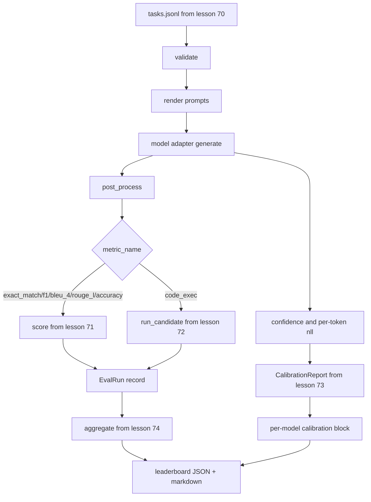

# 终极的杆跑者

> 运行员从第70课阅读任务规格,通过适配器打电话给模型,通过第71课和第72课得分,附加第73课的校准报告,并从第74课发出排名板.演示自动结束.

**Type:** Build
**Languages:** Python
**Prerequisites:** Phase 19 Track B foundations, lessons 70 through 74
**Time:** ~90 min

## 学习目标

- 定义一个`ModelAdapter`任何模型 (假装,本地,API) 可以通过小方法表面满足的接口.
- 运行评估在一个固定JSONL文件上,并行执行任务在一个工作组中.
- 复制一个传输中与校准层的测量层 (exact_match,F1,BLEU-4,ROUGE-L,code_exec).
- 发射每个模型`EvalRun`记录并直接将它们输入到排名表集成器中.
- 输出JSON报告和标记表;在清洁运行时输出零,在验证或运行时失败时输出零.

```figure
eval-grid
```

## 管道



跑者是集成点.每一个70到74课程都有一个模块,跑者构成.跑者不会复制这些模块的任何逻辑:它进口它们.

## 适配器接口

适配器是运行机和任何模型之间的接口.

```python
class ModelAdapter:
    model_id: str

    def generate(self, prompt: str, task: TaskSpec) -> Generation: ...
```

`Generation`是一个具有:

- `text`:模型的自由形式输出
- `confidence`水`[0, 1]`代表模型对答案的自我报告概率
- `token_nll`: 创建的代币的负记录概率的可选总和
- `token_count`:生成的代币的可选数量

跑步机中的假适配器提供了三个味道:`RuleBasedAdapter`子,子,子,子,子,子,子,子,子,子,子,子,子,子,子,子,子,子,子,子,子,子,子,子,子,子,子,子,子,子,子,子,子,子,子,子,子,子,子,子,子,子,子,子,子,子,子,子,子,子,子,子,子,子,子,子,子,子,子,子,子,子,子,子,子,子,子,子,子,子,子,子,子,子,子,子,子,子,子,子,子,子,子,子,子,子,子,子,子,子,子,子,子,子,子,子,子,子,子,子,子,子,子,子,子,子,子`NoisyAdapter`(过度自信,经常错误),`BiasedAdapter`演示全都在70课时进行.

## 并行执行

跑步者使用`concurrent.futures.ThreadPoolExecutor`按模型并行执行任务. 工作者数量默认为小于8个和任务数量. 线程是足够的,因为实际模型调用的瓶是网络 I/O. 代码执行路径在任务内部产生了自己的子进程,执行者只安排等待.

对于确定性测试,跑步者将暴露`run_eval(adapters, tasks, parallel=False)`为了测试,我们可以确定执行命令.

## 单通点分分循环

对于每项任务:

1. 返回提示 (几个次前置加上提示体).
2. 打电话给适配器,定时打电话.
3. 根据任务规则进行后处理.
4. 送到测量层.
5. 建立一个`EvalRun`记录与分数和指标元数据.
6. 添加`(confidence, correct)`配对到校准缓冲器.

其他`correct`信号是`score >= 1.0`对于 exact_match 类型的指标 (`exact_match`现在`accuracy`现在`code_exec`) 和`score >= 0.5`值在`_correct_from_score`跑步者不会暴露公开的过失.

## 总结

每个任务都得到了结果后,跑步者打电话`aggregate`其他`pairwise_diffs`根据第74课和`CalibrationReport.from_predictions`输出是一个JSON包裹:

```json
{
  "leaderboard": [...],
  "pairwise": [...],
  "calibration": {
    "model_id_a": {"ece": 0.04, "brier": 0.10, "populated_bins": 8, ...},
    ...
  },
  "summary": {
    "tasks": 10,
    "models": 3,
    "wall_seconds": 1.2
  }
}
```

运行者还将一个标记表写入 stdout,以便用户可以将结果粘贴到 PR 评论中.

## 自我终结的演示

演示程序在70课时10个固定任务中运行了3个模拟适配器.墙时间应该在10秒以下.清洁运行时退出代码是零.

清洁运营标准是:

- 每个任务都根据70课程得到验证.
- 每个任务都在第71和第72课下得到了分数.
- 校准报告在第73课下总结,没有错误.
- 排名表将基于规则的适配器排名在随机适配器的高度上.

如果其中任何一个破解,运行器将在JSON封中出现结构错误.

## 这一课不做什么

它不调用真实模型.它不实现API关键流程或速度限制处理.它不实现流媒体或部分生成;适配器每次调用返回一代.它不进行重试或缓存.这些问题在适配器层上存在;运行者是测量-无知和提供商-无知.

## 如何读取代码

`main.py`通过一个小的课程,它从其他五个课程模块进口.`_load_sibling`通过相对路径来解决这些问题.`Generation`现在`EvalReport`其他`ModelAdapter`模拟适配器在文件的底部.

阅读`main.py`查进口,然后看看`run_eval`现在`_score_one`现在,我们要做什么?

测试在`code/tests/test_runner.py`点适配器界面,单通路环,平行对序等等,校准缓冲器和JSON封面形状.

## 走得更远

产品评估系统添加:一个按键键键的结果缓存`(task_id, model_id, model_version)`根据"一轮"的数据,一个成本账本可以追踪每次运行的美元和代币,一个反试层可以支持利率限制,一个通过-at-k任务的样本取决策,以及长期套件的流媒体输出格式.这些都是一个单一的问题,而不会改变测量或聚合层.

接下来,你需要一个适配器,然后再给一个真正的供应商.
