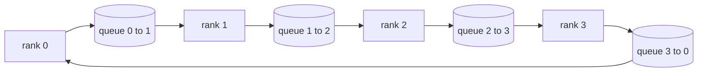

# 从零开始的集体行动

> 其他原始的培训框架提供了一个包裹. 建立它们一次在一个`multiprocessing.Queue`线,对它们进行检验,然后其余的轨道变成管道.

**Type:** Build
**Languages:** Python
**Prerequisites:** Phase 19 Track C lessons 42-49
**Time:** ~90 min

## 学习目标

- 实现环所有减少在两个通过 (减少分散然后全部集合) 并证明每级通信量为2(N-1) /N字节/元素.
- 建立广播,收集,并减少_散播点到点发送的顶部`multiprocessing.Queue`现在,我们要去.
- 检查每一个原始的对比`torch.distributed`对于相同输入的参考数据.
- 保护圆与树的选择,以集群形状,延迟地板和带宽天花板.

## 问题

一个天真的全减值在N数列上将N乘以子发送到根,并将N乘以回传输. 带宽尺寸为O(N) 每级,根成为瓶,墙钟地板是最慢的链接乘以N. 环全缩小到2 ((N-1) 块的尺寸T/N,因此每级字节降至2T ((N-1) /N,不论集群尺寸如何. 树全减小N和高延迟链接中获胜,因为深度是log2(N) 跳转而不是2(N-1). 选择错误的拓形态,最慢的GPU决定了步骤时间.

每个分布式训练框架,你会读到这个轨道,都取决于这些四个原始. 鱼DDP同步梯度,每个参数桶都能减少一个. 通过减少_散射,ZERO通过allgather进行更新参数的节目来缩小优化状态. FSDP将全向转换为allgather加减散. 管道并行需要在各阶段组之间进行激活的广播. 如果不能实现四个集体,你不能解释为什么训练停顿,为什么梯度不匹配在3级,或者为什么管道泡翻倍当你交换拓.

## 概念



### 环全减2次

按数值为 0..N-1的 N 个等数分. 每个级别都有一个等级的分数指数. 通过1,减少散射,运行N-1步骤. 在步骤s,r级 r将分数 (r - s) 调用 N 调用 (r + 1) 调用 N,并从分数 (r - s - 1) 调用 N 调用 N 调用 (r - 1) 调用 N,并将接收的分数积累到本地副本中. 在N-1步骤之后,r级拥有r部分的全部总数. 通过2,全部集合,再走N-1步骤,然后旋转完成的块环绕,直到每个排列都包含了每个块的全部总和.

| Primitive | Per-rank bytes | Steps | When to use |
|-----------|---------------|-------|-------------|
| Ring allreduce | 2T(N-1)/N | 2(N-1) | Large T, fat-pipe homogeneous cluster |
| Tree allreduce | T log2(N) | 2 log2(N) | Small T or high-latency links |
| Broadcast | T | log2(N) tree | Parameter init, scalar config |
| Allgather | T(N-1)/N | N-1 | Sharded forward, ZeRO unshard |
| Reduce_scatter | T(N-1)/N | N-1 | ZeRO gradient sharding |

### 排队网作为NCCL的替代

对于 CPU 来说,你没有这种情况.`multiprocessing.Queue`通过每个环边线,您可以在单个生产商和单个消费者之间进行点到点交付. 减少发生在用户空间中,因此您支付Python的费用,但线程图案与NCCL环全减相同. 原因在排队版本上的正确性和集群行为下面.

### 检查对黑色

每个原始人都会通过一个单位测试来比较其产量`torch.distributed`如果您的环全减差于光超过 float32 epsilon,测试失败.对参考实现进行验证是不可谈判的;如果没有它,原始的看起来是正确的,直到真正的训练运行的10000步.

```figure
ci-ring-allreduce
```

## 建立它

`code/main.py`执行:

- `Mesh`连接N的类`multiprocessing.Queue`入一个环,并暴露`send(dst, tensor)`其他`recv(src)`根据一个级别.
- `ring_allreduce(mesh, rank, world_size, tensor)`运行两个通行算法.
- `broadcast(mesh, rank, world_size, tensor, src)`在一个高数树上.
- `allgather(mesh, rank, world_size, tensor)`使用N-1旋转.
- `reduce_scatter(mesh, rank, world_size, tensor)`作为"全减"的第一半.
- `_gloo_reference(op, world_size, tensor)`通过相同的输入`torch.distributed`对于比较的字节等值,

运行它:

```bash
python3 code/main.py
```

输出:每次初始验证表对排列网和光线输出进行比较,随后是每次位数字节计数,证明2T(N-1) /N扩展.

## 野生生产模式

三个模式使原始人硬得足以运输.

**Bucket gradients before allreduce.**一个1B参数模型有数万个梯度子.每子的一个减缓器支付延迟地板N倍.DDP桶梯度成25MB块,并发出一个减缓器;小子在大的后面上.没有减缓延迟的上层主导步骤.

**Overlap communication with computation.**后方计算梯度层次按层次按反行顺序.当最后层梯度准备好时,启动其全减,而下层继续计算. PyTorch DDP 用桶式子线程进行计算.网络惰时,重叠将可见的通信时间减少一半.

**Pick ring or tree by message size, not religion.**NCCL发送一个拓学探测器,它选择了超过1MB的消息的环,下面的树.交叉式是带宽与延迟:在1MB以上,带宽术语2T(N-1) /N占主导地位,并且带赢得;在1MB以下,log2(N) 跳跃数量赢得.硬编码一个拓学成本错误的消息大小的吞吐量.

## 用它

生产模式:

- **PyTorch DDP.**电话`dist.all_reduce`后向的桶梯度.桶尺寸可以调整;默认25MB对于100Gbit以太网是合理的.
- **DeepSpeed ZeRO.**课程的原始性是 ZeRO 的呼叫.
- **FSDP.**进步开始于allgather去解散层次,计算,然后减少到 reduce_scatter,然后丢弃了解散.

## 运送它

在77-81课时使用排列网原始式.77课时,所有线程都减少到DDP.78课时,所有线程都减少到ZeRO.79课时,所有线程都将播放到管道激活中.81课时,所有线程都将被组建成端到端演示.

## 运动

1. 根据消息大小,将树变量减小,然后按环和树变换.
2. 添加一个`recv_timeout_ms`置的排名会出现截止日期错误,而不是永远挂在.
3. 取代`multiprocessing.Queue`测试的结果是相同的,真实线.
4. 添加一个带宽仪器,以使每位字节计数记录到JSONL.
5. 对于1KB,1MB,16MB的子,比较环与树的墙钟时间4行.

## 关键词

| Term | What people say | What it actually means |
|------|----------------|------------------------|
| Allreduce | "Sum across ranks" | After the call every rank holds the same reduced tensor |
| Ring | "The fast topology" | N-1 chunks of size T/N flow around the cycle twice |
| Tree | "The log topology" | Reduction follows a binary tree; depth is log2(N) hops |
| Allgather | "Concatenate shards" | Every rank ends with every other rank's shard |
| Reduce_scatter | "Split the sum" | Each rank ends with the sum of one chunk only |
| Bucket | "Fuse small tensors" | Coalesce N small allreduces into one large one |

## 进一步阅读

- [PyTorch Distributed: NCCL collectives](https://pytorch.org/docs/stable/distributed.html#collective-functions)
- [Horovod ring allreduce paper](https://arxiv.org/abs/1802.05799)
- [NCCL topology and algorithm selection](https://docs.nvidia.com/deeplearning/nccl/user-guide/docs/index.html)
- [Patarasuk and Yuan, Bandwidth optimal allreduce algorithms](https://www.cs.fsu.edu/~xyuan/paper/09jpdc.pdf)
- 第十阶段05课 - 分布培训概述
- 第19阶段 第77课 - - DDP线上这些原始
