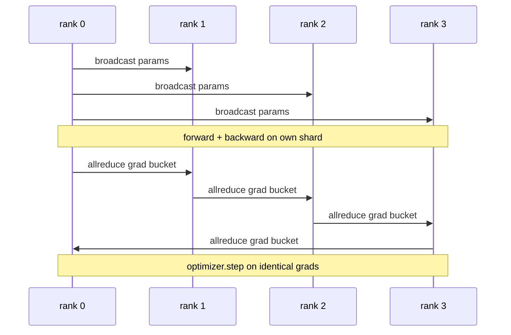

# 从零开始的数据并行DP

> 分布数据并行是所有降低的顶部的子. 包装一个模型,从排列0播放最初参数,使每个排列开始相同,安装一个向后的子在每个参数上,产生降低梯度的全部降低,其余是梯度下降.整个模式是200行.

**Type:** Build
**Languages:** Python
**Prerequisites:** Phase 19 Track C lessons 42-49
**Time:** ~90 min

## 学习目标

- 电线`DistributedDataParallel`形包装,可传输初始参数,并将向后降低梯度.
-  Spawn N CPU 排名为`torch.multiprocessing.spawn`通过文件的约会.
- 通过对相同数据进行测量,并显示每个步骤参数等效率来证明梯度同步正确性.
- 保护使用桶 (渐变融合) 和重叠 (后退时电流) 作为将工作的DDP转化为生产DDP的两个变化.

## 问题

一亿参数模型,具有12GB的激活,不适合于一个消费者GPU.即使它适合,训练也需要几周.数据平行将批量分为N排行,每个排行计算其碎片的前后,并且在每个步骤上每个排行的梯度被总和,因此所有N副本都保持相同.总的梯度是优化器步骤.

没有梯度同步,N复制器通过步骤2分离. 模型不再是"一个模型训练在更多数据"的,它是N个独立的模型, 由于梯度同步不佳 (每参数每次减少一个,没有重叠,没有桶) 网络是瓶, 由于DDP的技术, gradient同步几乎与计算相比自由. 标准的 PyTorch DDP 通过将梯度加上,重叠下层的倒退,并使用NCCL在NVLink上实现这一目标. 我们可以用GLOO在CPU上做这三件事,并学习相同的课程.

## 概念



### 需要DDP的三个操作

| Stage | Collective | Why |
|-------|-----------|-----|
| Init | broadcast from rank 0 | Every rank starts with the same parameters |
| After backward | allreduce of each grad | The mean gradient is what the optimiser steps on |
| Sometimes | broadcast of buffers | Batchnorm running stats stay synchronised |

### 为什么是恶意而不是总数

平均值与世界大小不变:一个排列调节的学习率在四个排列上运行,因为每步梯度大小不会改变.没有分数的Allreduce-SUM迫使你每次改变集群大小时重新调整学习率.DDP将SUM卷起来并分开;在课中做同样的事情.

### 为什么桶梯度

一个变压器有数千个参数子.每子的一个 allreduce 支付了黑暗延迟地板数千次.DDP 将梯度分为25 MB 桶,并发出一个 allreduce 桶.相同的总字节在线线上移动,但延迟在桶上被折扣.对于课程的小模型,我们将所有东西分为一个桶;结构是传递的.

### 为什么要着种子

每个级别都必须呼叫`torch.manual_seed(seed + rank)`为了乱,但`torch.manual_seed(seed)`参数 init.单个共享种子意味着每个级别都看到相同的批量顺序 (失败数据平行);参数的级别特定种子意味着初始参数不一致通过浮动epsilon和梯度同步不再使复制品相同.

```figure
ci-ddp-grad-sync
```

## 建立它

`code/main.py`执行:

- `MiniMLP`具有3层的MLP,足以在几秒钟内融合,足以暴露电线.
- `DistributedDataParallel(model, world_size)`果:在构建时发射节目,返回一个包装`sync_grads`总数和总数的毕业生按世界大小分.
- `worker(rank, world_size, ...)`                                       `torch.distributed`开始在暗,向前,向后,同步,步骤.
- `_reference_single_process_loop(...)`测试的结果:在每一步后,测试对字节等参数等效的测试中,

运行它:

```bash
python3 code/main.py
```

输出:一个步骤训练表,将单个过程损失和参数检查数与4行的DDP运行相比较.两个路径产生相同的损失曲线,以浮动epsilon,证明梯度同步是正确的.

## 野生生产模式

三个模式使DDP硬得足以运输.

**Find unused parameters.**某些前进路径会条件下跳过参数 (早期出口,专家混合路由器).跳过参数没有梯度,但DDP的桶式仍然等待它们,并减少了局. `find_unused_parameters=True`价格是每步走图,所以不要把它放下,除非你的前行分支.

**Static graph optimisation.**,当前的步骤稳定,`static_graph=True`预算节省每一步几毫米,而这些节约在1万步.

**Gradient accumulation needs care.**积累在K微分钟内的梯度,而不同步每个微分钟,是10倍的吞吐量获胜.`no_sync()`忘记管理员,你就无用地减少K次,吞吐量下降到地板.

## 用它

生产模式:

- **PyTorch DDP.**法规的实施.`torch.nn.parallel.DistributedDataParallel(model)`电线的互联,重叠,以及无_sync 环境.
- **HuggingFace Accelerate.**增加一个处理的发射器`torchrun`包装的模型和包装,同样是盖子下面的DDP.
- **Megatron-LM data parallel.**结合大型号的DDP和子平行;数据平行部分是相同的全部减后后回落模式.

## 运送它

课程78 (ZeRO分化) 将每参数allreduce取代为 reduce_scatter,因此每个级别只存储其优化状态的分化.课程81将DDP与ZeRO组合到端到端演示中.

## 运动

1. 添加可配置尺寸的梯度桶,并在更深层次的模型上测量加快与每参数减少一项的速度.
2. 实施`no_sync()`作为一个环境管理器,并验证梯度积累与K微型相匹配的单个过程基线.
3. 添加一个`find_unused_parameters`时时前进者跳过一个MLP层;如果没有旗,跑步将会陷入局.
4. 取代 gloo `torch.distributed.barrier()`只有同步,以感觉到所有降低和屏障同步之间的区别.
5. 测量梯度同步上层费用为批量1,16,256的步骤时间的小部分,并解释扩展.

## 关键词

| Term | What people say | What it actually means |
|------|----------------|------------------------|
| DDP | "Data parallel" | Wrapper that broadcasts params and allreduces grads each step |
| Bucket | "Fuse grads" | Group N small allreduces into one large one |
| Overlap | "Hide comm" | Issue allreduce while later layers still computing backward |
| no_sync | "Accumulate" | Skip the post-backward allreduce for gradient accumulation |
| find_unused | "Branchy forward" | Detect parameters with no grad before reducing |

## 进一步阅读

- [PyTorch DistributedDataParallel docs](https://pytorch.org/docs/stable/generated/torch.nn.parallel.DistributedDataParallel.html)
- [PyTorch DDP internals tutorial](https://pytorch.org/tutorials/intermediate/ddp_tutorial.html)
- [Li et al, PyTorch Distributed: Experiences on Accelerating Data Parallel Training](https://arxiv.org/abs/2006.15704)
- 第十九阶段 第七十六课 - 集体DDP建立在
- 第19阶段 第78课 - ZeRO碎片取代每参数所有减小的减小_分散
