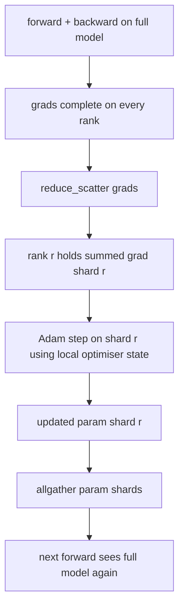

# 罗优化器状态碎片

> 亚当每参数存储两个时刻估计, 具有56GB的优化状态. 泽罗第1阶段将N级别的数量分成零件;每个级别拥有优化器的1/N. 在当地的步骤之后,更新的参数片段回放,每个级别重建完整的模型,下一步开始. 胜利是训练堆中最大的单个分配的线性记忆下降.

**Type:** Build
**Languages:** Python
**Prerequisites:** Phase 19 Track C lessons 42-49
**Time:** ~90 min

## 学习目标

- 切片优化状态 (第一时刻,第二时刻,fp32主副本) 在N排列中,因此每个排列拥有1/N.
- 使用 reduce_scatter 传递每个级别的分数,然后将所有分数汇集到更新的参数分数中.
- 计算第1阶段,第2阶段,第3阶段的存储存储表,与尼拉DP进行计算.
- 根据模型大小和带宽预算,捍卫1级与2级与3级的选择.

## 问题

尼拉DDP复制了一切:参数,梯度和优化状态在每个级别上都存在.对于fp16中的7B参数模型,这意味着每级别14GB参数,14GB梯度和28GB优化状态.优化状态是最大的术语,而且最容易碎碎片化,因为它只在步骤中触摸,而不是前进或后退.

RO第一阶段将优化状态缩小. 每个级别都包含亚当时刻的1/N. 后退, ZeRO 没有把全梯度降低,而是把它地步降低,所以每个阶层只能得到其碎片的总梯度. 排名将优化步骤应用到其主要参数的碎片. 更新的参数分片然后全部聚在一起,所以每个级别都有下一个前进的完整模型. 优化器内存下降了N. 每步线路流量与DDP相同:一个减少_散射加一个全部等于一个所有减少带宽. 记忆力胜利,输出力保持.

## 概念



### 泽罗的阶段

| Stage | What is sharded | Memory per rank | Comm per step |
|-------|----------------|------------------|---------------|
| DDP | nothing | params + grads + optim | 1x allreduce |
| ZeRO-1 | optimiser state | params + grads + optim/N | 1x reduce_scatter + 1x allgather |
| ZeRO-2 | optim + grads | params + grads/N + optim/N | 1x reduce_scatter + 1x allgather |
| ZeRO-3 | optim + grads + params | params/N + grads/N + optim/N | 1x allgather per layer + 1x reduce_scatter per layer |

阶段1是最便宜的胜利,因为优化状态占据预算.阶段2需要梯度分片积累逻辑,但带宽是相同的.阶段3 (FSDP) 为每一个前后层支付通信,获得参数分片内存下降.课程全面实现阶段1.

### 记忆的数学,实数

对于采用 Adam 混合精度训练的P参数模型:

| Term | Vanilla | ZeRO-1 | Why |
|------|---------|--------|-----|
| fp16 params | 2P bytes | 2P bytes | needed for forward |
| fp16 grads | 2P bytes | 2P bytes | needed for backward |
| fp32 master copy | 4P bytes | 4P/N bytes | only the optim uses it |
| fp32 first moment | 4P bytes | 4P/N bytes | only the optim uses it |
| fp32 second moment | 4P bytes | 4P/N bytes | only the optim uses it |
| Total | 16P bytes | 4P + 12P/N bytes |   |

在N=8时,尼 16P,ZRO-15.5P,下降65%.在N=64时,尼 16P,ZRO-14.19P,下降74%.

### 为什么减_散射击所有减-然后-分

总减给每个级别的全部总和梯度. 如果只需要分片r,那么降低的梯度的 (N-1) /N在r级别上会浪费. 降低_散射器提供了每个级别的分片;每级别的字节与allreduce相同 (因为allreduce是 reduce_scatter + allgather),但后面的第二半个部分被参数-shardallgather所取代. 网线与DDP相同,内存是分开的.

```figure
cd-zero-shard
```

## 建立它

`code/main.py`执行:

- `flatten_params(module)`其他`unflatten_into(module, flat)`单层的布局使得分类分类是一个简单的片段.
- `ZeroOptimizer(model, world_size, rank, lr)`拥有了"大版"和"亚当时刻"的阶级碎片.
- `step()`通过将"Reducer_Scatter"运行在平坦梯度上,将"亚当"应用到排列的碎片上,并将更新的参数收集到.
- 演示,训练一个3层的MLP20步骤,并印出每步的内存预算,

运行它:

```bash
python3 code/main.py
```

输出:每步损失,显示ZeRO-1的内存表在每个排列中保持1/N的优化状态,而DDP的完整副本.

## 野生生产模式

三个模式使Zero足够硬.

**Sharded checkpointing matters.**泽罗-1的优化状态分为各级;检查点必须记录哪个级别拥有什么.80课程构建了分碎的检查点宣言,重启了同样的世界规模的泽罗运行.没有它,保存的状态是无法读取的重启时.

**Mixed precision is the point.**采RO是一种混合精度技术; fp32 主版是碎片的.运行 ZeRO 没有混合精度支付了 fp32 主机上的内存税,而没有相应的 fp16 前进胜利.生产运行总是与自动或 bf16 重量对齐 ZeRO.

**Stage 1 is a near-free win.**通信带宽与DDP相同.存储存储在N中是线性的.唯一的成本是优化器分片的会计管理. 产量堆默认将进入第1阶段,除非参数分片存储也是问题;然后第二或第三阶段交易通信存储.

## 用它

生产模式:

- **DeepSpeed ZeRO.**参考实施`deepspeed_config.json`选择阶段1/3和分区尺寸.
- **PyTorch FSDP.**鱼原生同等.`ShardingStrategy.SHARD_GRAD_OP`是ZERO-2;`FULL_SHARD`现在,我们要做什么?
- **HuggingFace Accelerate.**罩着深度速度和FSDP在一个统一的配置.

## 运送它

第79课 (管道平行) 是直角分断轴:而不是在同一模型中分断优化状态,管道分断层跨行. 第81课组建了DDP + ZeRO在端到端演示中.

## 运动

1. 通过碎片梯度扩展到ZERO-2:每个级别只存储其碎片梯度,通过向后零化非碎片部分来实现.
2. 添加一个存储器配置文件,将实际的fp32字节使用量在0级与公式预测中打印.
3. 测量尼拉DDP与ZERO-1的每步墙钟时间,并分解成前进,后退,通信.
4. 根据 ZeRO-1 实现梯度切割:L2标准必须通过所有碎片计算在地方标准的二方体中.
5. 通过 allreduce而不是 reduce_scatter 实现"天真 ZeRO",测量电线时间差异.

## 关键词

| Term | What people say | What it actually means |
|------|----------------|------------------------|
| ZeRO-1 | "Shard the optimiser" | Each rank holds 1/N of fp32 master + Adam moments |
| ZeRO-2 | "Shard grads too" | Each rank also drops the non-shard gradients after reduce_scatter |
| ZeRO-3 | "Shard params" | Each rank holds 1/N of fp16 params; allgather per layer in forward |
| Master copy | "fp32 weights" | The high-precision parameter copy the optimiser updates |
| Reduce_scatter | "Split the sum" | Deliver each rank only its shard's summed gradient |

## 进一步阅读

- [Rajbhandari et al, ZeRO: Memory Optimizations Toward Training Trillion Parameter Models](https://arxiv.org/abs/1910.02054)
- [DeepSpeed ZeRO documentation](https://www.deepspeed.ai/tutorials/zero/)
- [PyTorch FSDP documentation](https://pytorch.org/docs/stable/fsdp.html)
- 第十九阶段 第七十六课 - 减少_分散和聚合
- 阶段19课80 - 切片检查点, ZeRO国家必须使用
