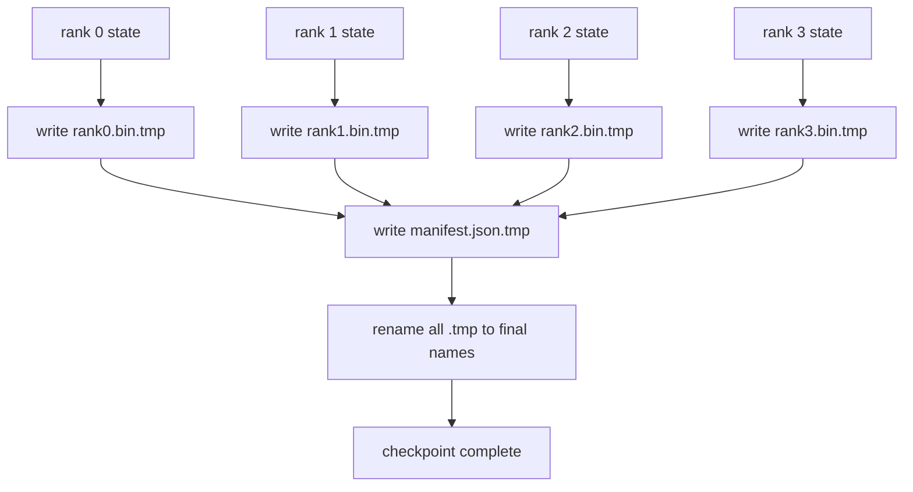

# 核核复核和核核复核

> 节点失败每隔几小时就会停止70B参数训练工作. 检查点的格式决定你是否会失去30分钟或30小时. 一个分碎的检查站,并列写每个级别的分碎,并记录所有权在公开表中. 恢复将每个级别的分片从其自己的文件中加载, 重建状态在相同的世界尺寸, 原子写法可以防止一个半完成的检查点毒害下一个简历.

**Type:** Build
**Languages:** Python
**Prerequisites:** Phase 19 Track C lessons 42-49
**Time:** ~90 min

## 学习目标

- 保存一个多级检查点作为一个每级分片文件加上一个记录哪个级别拥有什么的表格.
- 使用原子写模式 (写到临时路径,然后更名),这样一个崩盘中写永远不会产生半完成的检查点.
- 从表格中恢复,验证对 fp16参数和Zero优化器状态的字节等级状态.
- 保护表达式方案免受三种失败模式:世界规模变化,碎片数量不匹配和部分写.

## 问题

尼拉检查站将所有参数和优化状态读取到0级,收集,并编写一个文件. 对于70B模型来说,一个级别的网络端口是1.1TB的状态. 写作者阻碍了其他等级,因为他们忙等待聚会.  IO 带宽是单个GPU的网络链接最慢,而不是总数. 在实体集群中,收集然后写的步骤可能比上一次培训时间更长,这意味着工作人员每天都会出差不多一个检查点.

碎片化检查站翻转了模式:每个级别都在平行地写出自己的碎片. 任何一块的记录可以让每块回归原来的位置. 总体写带宽尺度与集群. 一个1TB检查点需要4个小时通过一个排名,需要4分钟通过64个排名. 另外,手表给你一份不兼容的简历合同: 随着世界规模的变化, 部分写字可以检测到,

## 概念



### 显现式方案

```json
{
  "world_size": 4,
  "step": 1234,
  "wall_clock_seconds": 4521,
  "shards": [
    {"rank": 0, "path": "rank0.bin", "sha256": "...", "param_shard_offset": 0, "param_shard_numel": 65536},
    {"rank": 1, "path": "rank1.bin", "sha256": "...", "param_shard_offset": 65536, "param_shard_numel": 65536}
  ],
  "schema_version": 1
}
```

现在有三个场面承载.`world_size`让一个不同尺寸的简历大声失败而不是默默腐败.`sha256`部分或腐败的写作.`param_shard_offset`其他`param_shard_numel`按分片,让载体在正确位置重建平面参数子.

### 原子写

标准模式:写每一个碎片到`<name>.tmp`写下明文给`manifest.json.tmp`由于在一个文件系统中,一个文件的重命名是原子的.新文件完全存在或旧文件是.在最后的重命名之前的崩离开了前一个检查点,作为现实.没有原子写,一个崩可以留下一个部分碎片,一个现有表格指向它,负载破坏了恢复的优化状态.

### 系统必须防范三个故障模式

| Failure | Symptom | Defence |
|---------|---------|---------|
| World-size change | resume on N=8 with manifest from N=4 | world_size mismatch in manifest, fail loudly |
| Shard count mismatch | resume sees fewer rank*.bin files than shards in manifest | enumerate shards, verify every one exists |
| Partial write | shard file truncated mid-flush | sha256 verification on load |

每个辩护都早些时候拒绝了坏负担; 替代方案是沉默的腐败,

### 为什么每位档案,而不是一个大档案

通过一个文件同时写`O_APPEND`在POSIX上使用字节一致的写字,但实际上,一个片段内的偏移跨度是MB大小区域,锁定占主导地位.当底层文件系统平行时,每级文件没有争议,并且从条纹中获益 (Lustre,GPFS).生产堆 (DeepSpeed,FSDP,NeMo) 都使用每级文件.

```figure
ci-sharded-checkpoint
```

## 建立它

`code/main.py`执行:

- `ShardManifest`上面的方案加上数据类`to_json`现在,我们要去.`from_json`现在,我们要去.
- `save_sharded(state_dict_per_rank, dir, step)`通过原子的时间,然后重命名模式,然后写出表格.
- `load_sharded(dir, expected_world_size)`检查每个碎片的 sha256 ,并返回每级状态指令.
- 复程测试:构建每级状态,保存,加载,断定字节等等.

运行它:

```bash
python3 code/main.py
```

输出: 4 个分片文件加上写出表格,然后用字节等等验证重新加载.

## 野生生产模式

只有三个模式使检查站变得硬得可以运输.

**Async write.**生产堆发出检查点写在单独的线程或过程,因此训练继续. 屏障在下一个检查点:不要开始下一个保存直到之前的完成.`async_io`课程保持写作同步,让步骤是可见的.

**Local fast disk first, then async upload.**写到本地NVMe (快速) 然后与S3或GCS进行同步上传. 两层格式模式使集群中检查点保持恢复速度,同时将持久的副本出于集群用于档案.表格载有本地路径;上传表格载有远程路径.

**Rotation matters.**生产运行保持最后的K检查点 (通常是3-5),并旋转最旧的.没有旋转,磁盘填满了运行中期,下一个检查点失败了.随着旋转,下一个保存首先删除了最旧的,从而释放了预算.

## 用它

生产模式:

- **DeepSpeed checkpointing.** `deepspeed.save_checkpoint(tag=step)`编写每级文件和一个`latest`文件指向活跃标签.
- **PyTorch FSDP checkpointing.** `torch.distributed.checkpoint`保存碎片状态`Planner`根据每位排名的排名.
- **NeMo.**绕着深速和FSDP的制服`save_to_checkpoint`增加元数据的API.

## 运送它

课81节节省了DDP+ZeRO的端到端运行的一个分断检查点,并将其重新加载到相同的世界规模,以证明简历合同有效.

## 运动

1. 添加异步写:启动一个线程中的保存,让训练继续. 阻止下一个保存直到之前的保存完成.
2. 添加一个`last_5_steps`转换:保持最新的5个检查点,在保存新的之前删除最旧的检查点.
3. 加入仅使用CRC的快速验证路径,用于内部循环重装 (旋转将检查点转换为新的活跃点,没有完整 sha256).
4. 通过阅读表格,连接和重新分割,从N=4到N=8的碎片重平衡.
5. 添加一个上传到一个假的S3 (第二个目录) 和写上传说明书. 捍卫两层存储政策.

## 关键词

| Term | What people say | What it actually means |
|------|----------------|------------------------|
| Sharded checkpoint | "Per-rank save" | Each rank writes its own shard file in parallel |
| Manifest | "Index" | JSON file recording shard paths, offsets, and sha256 |
| Atomic write | "tmp then rename" | Write to .tmp then POSIX rename so a crash leaves the previous file live |
| Partial write | "Truncated shard" | A crash during write produces a corrupt shard; sha256 catches it |
| Rotation | "Keep last K" | Delete oldest checkpoint before writing new one to bound disk usage |

## 进一步阅读

- [DeepSpeed checkpointing](https://deepspeed.readthedocs.io/en/latest/model-checkpointing.html)
- [PyTorch torch.distributed.checkpoint](https://pytorch.org/docs/stable/distributed.checkpoint.html)
- [POSIX rename atomicity](https://pubs.opengroup.org/onlinepubs/9699919799/functions/rename.html)
- 阶段19课程78 - 泽罗状态这个检查站是以保存
- 第19阶段 第81课 - - 终端到终端的演示,回复保存的状态
