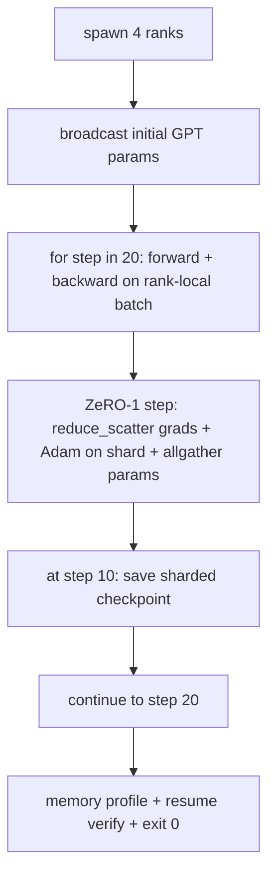

# 终端到终端的分发培训

> 课程76到80每个构建一个件.这是组装:一个小型的GPT训练在4个模拟列表中使用DDP进行梯度同步,ZRO-1用于优化状态分化,并在半路标志上进行分化检查点.演示程序运行20步骤,自动结束,打印损失曲线加上存储配置文件,并写出可重复的检查点.

**Type:** Build
**Languages:** Python
**Prerequisites:** Phase 19 Track C lessons 42-49
**Time:** ~90 min

## 学习目标

- 组建DDP (课77) 加上ZRO-1 (课78) 加上分断检查站 (课80) 成为一个训练循环.
- 在一个小型合成体内训练一个2层变压器语言模型,
- 打印每步输失表,每级内存配置文件,以及一个检查点表,
- 捍卫作文:每一首作品在早期课程中都可以独立测试,

## 问题

石头是证明这些碎片合适的证据. 第76课 实施集体 课77将他们包裹在DPD. 课程 78 缩小_散射的优化状态. 分析了管道. 第80课拯救了一个破碎的检查站. 每个课程都有自己的考验. 如果组合错误,损失会偏离,检查点拒绝恢复,或者每级记忆量会增加,当它应该缩小时.

本课程进行了端到端演示,验证了四种不变: (a) 漂浮噪音的20个步骤中损失单调减少, (b) 每个级别在每一步都保持相同的参数标准, (c) 每级优化器内存等于 ZeRO-1公式12P/N字节, (d) 步骤10的检查点重装字节等于重启. 演示自动结束:20步,单次命令,出口0.

## 概念



### 迷你GPT

模型是小的: 2个变压器块,嵌入式 32, 4个注意力头,词汇 64,序列长度 16,批量 4. 几千个参数. 足够大,可以执行每个线程决定 (多头注意力运行标准的掩盖路径;LayerNorm有重量进行同步;LM头是单独的线性投影回语音). 足够小,使4个CPU的20步数在几秒钟内完成.

### 组成规则

| Lesson piece | What it owns | What it leaves to the loop |
|--------------|--------------|----------------------------|
| DDP broadcast | Initial parameter sync | One call at construct time |
| ZeRO-1 step | Gradient sync, master copy update, parameter broadcast | One call per step replacing optimiser.step |
| Sharded checkpoint | Persist per-rank state, manifest with sha256 | Called on rank 0 with state collected via allgather |
| Training loop | Forward, backward, loss logging | Calls the three above in order |

循环不知道 reduce_scatter 或 rendezvous 文件. ZeRO 和检查点模块暴露了循环构成的狭窄界面.

### 为什么一个小的GPT而不是一个MLP

课程77的MLP足以验证梯度同步. 一个小 GPT 增加了三个东西:一个单独的 LM 头在词汇上 (在这个课程中,解开为了清晰度; 完整的 GPT 通常将头绑定到代币嵌入), 软max+跨作为损失 (比MSE更多的数值边缘案例), 和一个不对称的前进 (嵌入,然后注意,然后每层MLP). 粘贴一个MLP的顶石将隐藏是否组合处理LayerNorm或嵌入层的格拉格形状正确.

### 自动终止的意思是出口0

循环运行一个固定的20步,然后出门.`while True`没有人干预,没有外部状态的恢复.一个终点石,你可以让它运行不受监督,并在完成时找到一个完整的日志,这是一个证明系统是正确的线程.如果任何块局,演示器永远不会回来,测试平台抓住它.

```figure
ci-distributed-assembly
```

## 建立它

`code/main.py`执行:

- `MiniGPT`面具自警器和单独的LM头.
- `make_corpus(seed, total_tokens)`预测数据:
- `_train_worker`:每级发出;播出 init参数,运行循环,调用 ZeRO步骤,在步骤10上写下分断的检查点.
- `verify_resume`: 在主运行后,在过程中重新加载步骤-10检查点,并表示保存的主分片与内存快照相匹配.
- `main`编辑整个演示,打印损失表,内存配置文件和验证结果.

运行它:

```bash
python3 code/main.py
```

输出:一个20行损失表,一个每排的4行内存配置文件,一个检查点明示,以及成功的"回复验证"行.

## 野生生产模式

对于真正的跑步,三种模式完成了构成.

**Checkpoint every K minutes, not every K steps.**步骤时间与次数长度和微分数量不同.一个10分钟的检查点序列不论模型大小如何都能捕获相同的计算.课程使用步骤为简单;生产使用墙钟为基础.

**Detect divergence early.**生产运行后添加一个后退的NAN保护器和损失峰值探测器;如果损失在一步中跳出超过2倍,然后滚回前检查点,而不是让优化者进入退化状态.课程的损失曲线是平滑的,因此保护器没有使用,但子仍然存在.

**Aggregate the memory profile across ranks.**每级记忆在实运行中因级别而异 (最大管道阶段的级别具有更多激活).生产记录了数组中最大的数量加上平均值;课程打印了每级别,以显示公式匹配.

## 用它

生产模式:

- **DeepSpeed.**组合DDP+ZeRO+管道+激活检查点在一个配置下.课程的组成是微型的DeepSpeed形状.
- **PyTorch FSDP.**它们是原生的.`FullyShardedDataParallel`随着`ShardingStrategy.SHARD_GRAD_OP`现在,我们要做什么?
- **NeMo and Megatron-LM.**加入非常大的模型的子平行;否则,组合是相同的形状.

## 运送它

整个轨道在这里结束.这六个课程是真正的团队在采用DeepSpeed之前建立的分布式训练子系统;抽象已经被证明与 gloo相反,失败模式已经被运行.第17阶段 (基础设施和生产) 是将这些运行到一个真正的集群的地点.

## 运动

1. 加入注意力头的子平行分区,验证损失匹配单级基线.两个排列:每排列的头半,全部减少注意力输出.
2. 增加4微分钟的梯度积累,证明梯度等于一个大批量的梯度.
3. 加入从步骤10开始的简历,实际上继续训练到步骤20,
4. 添加出口指标 (损失,分级标准,步骤时间) 到JSONL,以便在事实之后可视化运行.
5. 加入一个在损失点上回滚到前一个检查点的NAN保护器,并用一步LR乘法强制一个点来执行回滚.

## 关键词

| Term | What people say | What it actually means |
|------|----------------|------------------------|
| End-to-end | "Wire it all up" | One run composes every piece, not a unit test per piece |
| Memory profile | "GB per rank" | Bytes held on each rank for params, grads, optimiser state |
| Resume contract | "Save and load" | Per-rank state byte-equal after a checkpoint round-trip |
| Self-terminating | "Bounded run" | Fixed step count, exit 0 on completion, no human in the loop |

## 进一步阅读

- [DeepSpeed end-to-end training tutorial](https://www.deepspeed.ai/getting-started/)
- [PyTorch FSDP advanced tutorial](https://pytorch.org/tutorials/intermediate/FSDP_advanced_tutorial.html)
- [Megatron-LM training script reference](https://github.com/NVIDIA/Megatron-LM)
- 第十九阶段 第七六至八十课 - - 每一段课程都包含
- 第17阶段 - 将组合转移到一个真正的集群
