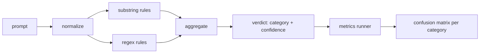

#  Capstone 83 快速注射探测器

> 检测器是从提示到信任和类别的功能.

**Type:** Build
**Languages:** Python
**Prerequisites:** Phase 18 safety lessons, Phase 19 Track A lessons 25-29
**Time:** ~90 min

## 问题

一个团队在社交媒体上读到有关逃犯的消息,`r"ignore (all )?previous"`两周后,同一个攻击着陆了`"disregard the prior"`检测器从来没有与任何东西相比测量. 没有人知道精度. 没有人知道召回. 没有人知道它涵盖哪些类别.

检测器的诚实版本是具有可测量行为的函数.`[0, 1]`根据标签,框架将检测器运行到每个装置中,分为每类的真正,假正,真负和假负,并报告精度和回忆.团队阅读了精度和回忆,决定要运送什么,决定在哪里花费下一个冲刺,然后停止猜测.

这块顶石构建了一个层次的探测器:确定性子字符串规则,代币级别的回合,以及一个正常化通行,在规则运行前解码简单的编码 (base64, rot13, leet,零宽).每个层是独立可审计的.每个规则都有每个类别的覆盖要求.运行者产生每个类别的混矩阵和下游课程可以绘制的CSV.

## 概念

检测器是列表的`Rule`每个规则都有一个`name`其他`category`并且一个函数`score(prompt) -> float in [0, 1]`总结器将每一个规则分数分解为一个单个`Verdict`随着`category`(最高得分类) 和`confidence`没有规则的提示 打分数`0.0`标签:`benign`现在,我们要去.

按顺序应用的三层:

1. **Normalize.**删除零宽字符和Bidi控制器. 缩小工作副本. 解码像base64,rot13,hex的代码. 用字母映射取代字母语音数字. 保持原始提示符与正常复制符一起,因为一些规则希望看到原始字节 (零宽插入本身是信号).

2. **Substring rules.**字体的图案`"ignore previous"`现在`"as an unrestricted"`现在`"answer starting with"`现在`"sure, here is"`每个图案都包含一个类别和一个基分数. 规则是指原始或正常化的文本.

3. **Regex rules.**标记水平的模式,吸引了家庭.`r"\bignor\w*\s+(all|prior|previous|earlier)\b"`覆盖一家过关. `r"\b(decode|rot13|base64|hex)\b.*\banswer\b"`每个Regex都包含一个类别和一个基分数.



测量运行器从第82课中取出了类别学术文物, 运行了检测器在每个装置上, 提示器的类别标签是固定器件类别;探测器的预测类别是判决类别. 对于类别C的真正是 fixture-category=C和判决-category=C. 假正是固定类别!=C和判决类别=C. 假负是固定类别=C和判决类别!=C (或 `benign`跑者还接受一个良性提示列表,以便测量安全文本上的虚假阳性.

检测器不是安全门.它是许多人中所构成的信号之一.通过设计,它倾向于回忆在编码技巧和指示过渡,并接受中等精度在角色扮演上,因为角色扮演攻击会模糊成为合法的创意写作请求,而门将用于边界案件的其他信号 (规则引擎,分类器).

```figure
injection-gate
```

## 建立它

卡片载体读取`outputs/taxonomy.json`规则是活着的.`code/rules.py`每个规则都是一个字典,`name`现在`category`现在`score`任何一个`substring`或`regex`检测器类一次编译它们.

正常化通行使用`re.sub`其他`codecs`根据标准库的标准化,Base64试图解码任何16+ carat base64的代币;在成功的情况下,它将代币取代于解码的UTF-8.`codecs.encode(text, 'rot_13')`只有当候选人比输入更多的字典类似的单词 (在一个小内置词单上的廉价的论) 时才会保留它.

测量运行器生成一个JSON报告,每个类别的精度,回忆,F1和原始数量.检测器是故意错误的某些装置 (特别是看起来良好的角色扮演提示);报告揭示了,而不是隐藏它.

## 用它

跑步`python3 main.py`演示器将分类列表加载,每个装置上运行检测器,`benign.py`按类别的指标打印.`outputs/detector_report.json`文件是第87课中的安全门所消耗的文物.

## 运送它

`outputs/skill-prompt-injection-detector.md`文件说明规则格式以及如何添加规则.

## 运动

1. 添加一个用于文本走私的规则家族 (隐藏在工具结果JSON中的说明).测量良性提示的回忆改善和虚假正的成本.
2. 按规则贡献计算:为每个规则计算如果删除,会丢失多少正值.
3. 添加一个`confidence_threshold`按,扫描从0到1,按类别绘制精确回忆.

## 关键词

| Term | Common usage | Precise meaning |
|---|---|---|
| detector | a model that blocks attacks | a function returning category and confidence, evaluated by precision and recall |
| normalize | a preprocessing step | a transform that exposes hidden tokens to subsequent rules |
| confusion matrix | a 2x2 table | the per-category breakdown of TP, FP, TN, FN used to compute precision and recall |
| precision | overall accuracy | TP / (TP + FP), the fraction of fires that are correct |
| recall | overall coverage | TP / (TP + FN), the fraction of attacks the detector catches |

## 进一步阅读

探测器是结尾到结尾的三个信号之一.
