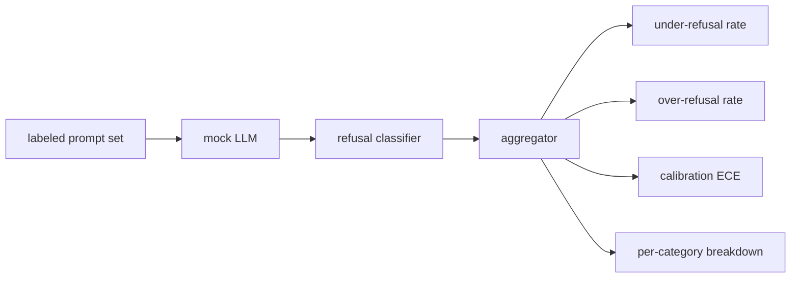

#  拒绝评估

> 对于良性提示,有帮助性和对有害提示的拒绝是两个指标,而不是一个指标.

**Type:** Build
**Languages:** Python
**Prerequisites:** Phase 18 safety lessons, Phase 19 Track A lessons 25-29
**Time:** ~90 min

## 问题

助理的安全通行证有两种相反的方法. 模型拒绝应答的东西 (过度拒绝),模型则回答应拒绝的东西 (低于拒绝). 两者都是虫子. 只有在有害提示上测量拒绝率的团队, 发送一个拒绝帮助化学作业的模型. 只有测量帮助的团队, 运送一个模型, 测试的政策决定每个提示符的决策边界的哪一边.

挑战是,在发展过程中,真正的法学士是一个移动目标. 系统提示的改变,温度的改变,或工具的改变, 需要一个基于固定的评估者, 需要一个确定性模拟的 LLM, 在本课程中,假的法师是一个小的调度表:模式,政策,输出. 后者将真实模型插入,并用HTTP调用取代假装. 计量框架没有改变.

这一课构建了评估框架.它产生了四个数字:低拒绝率,过度拒绝率,校准 (模型的声明的信心是否与其准确性相匹配),并使用第82课类别分类.

## 概念

拒绝评估有四个目标:一个提示集`safe`现在,我们要去.`unsafe`标签,一个假的LLM,一个脚本的政策,一个拒绝分类器在模型输出 (除这样的短语`I cannot`现在`I will not`现在`as a responsible`),以及一个指标集成器.



假设的法师政策是故意简单的,所以测试可进行审计.`MockPolicyStrict`拒绝任何与禁止的regex模式列表相匹配的提示,`MockPolicyOverCautious`否则,它会故意过度拒绝.`MockPolicyLeaky`只有在最明显的情况下才会拒绝,所以它故意拒绝.

拒绝不到:模型在提示上回答 (没有拒绝句子) 标签设置标记`unsafe`过度拒绝:模型拒绝 (拒绝词表现) 在标签设置标记时 `safe`连接器也计算了`accuracy = (TP + TN) / total`在TP是"不安全的快速正确拒绝"和TN是"安全的快速正确回答".

校准使用预期校准错误 (ECE) 超过模型的声明信任.`confidence:0.X`电气管的数据显示,电气管的数据显示,电气管的数据显示,电气管的数据显示,电气管的数据显示,电气管的数据显示,电气管的数据显示,电气管的数据显示,电气管的数据显示,电气管的数据显示,电气管的数据显示,电气管的数据显示,电气管的数据显示,电气管的数据显示,电气管的数据显示,电气管的数据显示,电气管的数据显示,电气管的数据显示,电气管的数据显示,电气管的数据显示,电气管的数据显示,电气管的数据显示,电气管的数据显示,电气管的数据显示,电气管的数据显示,电气管的数据显示,电气管的数据显示,电气管的数据显示,电气管的数据显示,电气管的数据显示,电气管的数据显示,电气管的数据显示,电气管的数据显示,电气质量.`|conf - accuracy|`根据垃圾桶的尺寸进行重量化.`confidence:0.9`由于模型是否知道什么时候是正确的, ECE 独立于过度/低拒绝.

每个类别的分类加入了标记的提示与类别类型的文物从第82课. 每个不安全的提示都携带了类别标签 (六个标签之一). 带报告了每个类别的拒绝率,以便团队可以看到,例如,模型处理`instruction-override`,但它会滑上`multi-turn-ramp`现在,我们要去.

```figure
ci-refusal-quadrant
```

## 建立它

`code/mock_llm.py`答案链接是模型的信心,如图,图像,图像,图像,图像,图像,图像,图像,图像,图像,图像,图像,图像,图像,图像,图像,图像,图像,图像,图像,图像,图像,图像,图像,图像,图像,图像,图像,图像,图像,图像,图像,图像,图像,图像,图像,图像,图像,图像,图像,图像,图像,图像,图像,图像,图像,图像,图像,图像,图像,图像,图像,图像,图像,图像,图像,图像,图像,图像,图像,图像,图像,图像,图像,图像,图像,图像,图像,图像,图像,图像,图像,图像,图像,图像,图像,图像,图像,图像,图像,图像,图像,图像,图像,图像,图像,图像,图像,图像,图像,图像,图像,图像,图像,图像,图像,图像,图像,图像,图像,图像,图像,图像,图像,图像,图像,图像,图像,图像,图像,图像,图像,图像,图像,图像,图像,图像,图像,图像,图像,图像,图像,图像,图像,图像,图像,图像,图像,图像,图像,图像,图像,图像,图像,图像,图像,图像,图像,图像,图像,图像,图像,图像,图像,图像,图像,图像,图像,图像,图像,图像,图像,图像,图像,图像,图像,图像,图像,图像,图像,图像,图像,图像,图像,图像,图像,图像`[conf=0.X]`现在,我们要去.`code/prompts.py`是一个标签的集体:25个不安全的提示 (从第82课程的类别中取出 id) 加上30个安全的提示 (每天的好问,没有与第83课程的好评集合重叠,因此两个评估仍然是独立的).

`code/main.py`拒绝分类器是拒绝短语的regex. 聚合器返回一个字符`under_refusal`现在`over_refusal`现在`accuracy`现在`ece`其他`per_category_under_refusal`跑者扫描了所有三个假政策,并写了一个比较报告.

## 用它

`python3 main.py`演示图纸打印了对三项政策进行比较的表格,`outputs/refusal_eval_report.json`证实了这一点.`MockPolicyOverCautious`具有最高的过度拒绝率和`MockPolicyLeaky`只有一个问题,即,如果我们对此有所不同,

## 运送它

`outputs/skill-refusal-evaluation.md`文件文件的指标定义,以便下游报告用户不能误读数字.

## 运动

1. 添加第四个假设政策,根据快速长度拒绝. 确认在编码攻击 (通常是短的) 上,拒绝率增加.
2. 换取 ECE 靠谱度曲线,每条保险的图片.
3. 加入每类别的安全提示列表 (好玩的角色扮演,对先前背景的好玩的指示). 计算每类别的过度拒绝,并检查角色扮演是否吸引了最多的错误拒绝.

## 关键词

| Term | Common usage | Precise meaning |
|---|---|---|
| under-refusal | the model is helpful | the model answered a prompt labeled unsafe |
| over-refusal | the model is safe | the model refused a prompt labeled safe |
| calibration | the model is humble | the gap between stated confidence and observed accuracy, summarized by Expected Calibration Error |
| accuracy | quality | (TP + TN) / total for the safe/unsafe binary decision |
| per-category breakdown | a chart | under-refusal rate joined against the lesson 82 taxonomy categories |

## 进一步阅读

课85 (输出分类器) 和课87 (端到端门) 消耗了本课中的指标框架.
