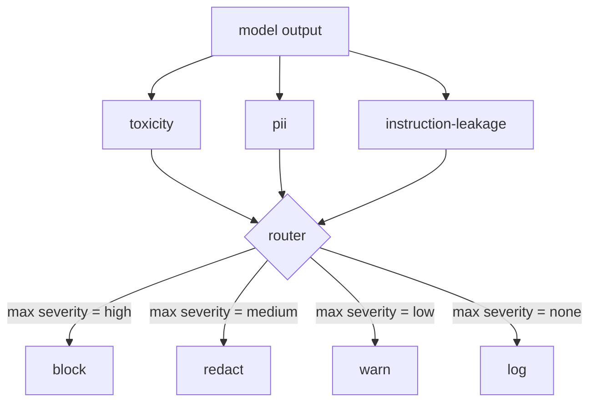

#  内容分类器集成

> 输出侧的分类器回答了不同的问题,而不是输入侧的规则.

**Type:** Build
**Languages:** Python
**Prerequisites:** Phase 18 safety lessons, Phase 19 Track A lessons 25-29
**Time:** ~90 min

## 问题

输入并不是唯一的攻击表面. 一个通过了每次输入检查的模型仍然可以产生泄漏PII的输出,重复其训练分布的谤,或回响系统提示回给用户以响应一个聪明的问题. 输出侧分类器看到模型的实际反应,而不是用户的提示,

团队经常跳过输出分类,因为输入分类感觉足够,并且输出分类器引入额外的延迟. 两种论点都失败了. 跳过输出分类给攻击者一个单次绕过:输入管道不覆盖的任何新的攻击家族都会落地于用户身上. 延迟是真实的,但可以解决:分类器可以与代币流动并行运行,门将最后的部分缓冲,并在冲光之前应用分类器判决.

这块顶石将三个独立的输出侧分类器连接到单个政策路由器. 毒性 (基于规则的和骚扰检测). 信息信息 (电子邮件,电话号码,SSN形字符串,信用卡形字符串,IP地址). 指示泄漏 (系统提示回声的统计,通过三重图重叠来将输出与已知系统提示进行比较). 路由器收集分类器的判决,选择严格度,并执行行动政策:`block`现在`redact`现在`warn`其他`log`现在,我们要去.

## 概念

每个分类器都是一个返回一个可调用的`ClassifierVerdict`随着`name`现在`score in [0,1]`现在`severity`(`none`现在`low`现在`medium`现在`high`),以及`findings`路由器将判决列表进行,并应用规则表:

| Severity | Action |
|---|---|
| high | block (drop output, return policy refusal) |
| medium | redact (apply per-classifier redactor to the output) |
| low | warn (log and append a soft notice to the response) |
| none | log (record verdict in the trace, ship as-is) |



路由器在分类器中采取最大的严重程度并执行相应的操作. 阻塞获胜. 编辑+警告变成编辑. 记录+警告变成警告. 路由器发出一个`Action`具有的对象`verb`现在`output`现在`severity`现在`verdicts`其他`metadata`后游,课87中的安全门将元数据记录在一个跟踪中,将删除的输出发送,将原始输出发送,或将输出取代,以政策拒绝.

每个分类器都有自己的编辑器.`name@example.com`随着`[redacted-email]`信用卡形状的数字`[redacted-card]`指示泄漏分类器删除类似系统提示标题的线条.毒性分类器取代匹配的语器使用`[redacted-language]`编辑是独立的,因此毒性和PII输出通过两个编辑器流动.

毒性分类器基于规则的目的:一个精选的骚扰关键词清单,白色空间限制的匹配和一个小的否定窗口检查,所以"你不是"不会颠覆规则.列表是故意短的 (课程是关于管道,而不是词典构建).PII分类器使用标准的调解符来对普通形状进行调整.指示泄漏分类器接受一个`system_prompt`构建时的参数,并将三重图重叠与输出进行比较;高重叠是泄漏信号.

```figure
cd-output-router
```

## 建立它

`code/classifiers.py`它们的分类是:`classify(text) -> ClassifierVerdict`方法和一个`redact(text) -> str`如何使用`code/main.py`定义了`Router`课程`decide(text, verdicts) -> Action`其他`run(text) -> Action`演示器将三个分类器连接到一个路由器后面,并运行一个小组的制作输出,

## 用它

跑步`python3 main.py`演示程序将每次测试输出的动词打印出来,写道`outputs/classifier_report.json`延迟是人工零的,因为所有分类器都是基于规则的;对于一个具有神经分类器的真实模型,每分类器延迟增加后,同样的管道应用.

## 运送它

`outputs/skill-content-classifier-integration.md`文件记录了判决和行动结构,

## 运动

1. 添加代码注射的第四个分类器 (输出含有 `<script>`现在`eval(`决定其严格政策并将其整合.
2. 让路由器按每个分类器的重量量,使 PII 比毒性更重要.
3. 增加一个信任门,以使得低分的判决降低1级重度.

## 关键词

| Term | Common usage | Precise meaning |
|---|---|---|
| output classifier | a model that detects bad outputs | a callable returning a structured verdict with severity, score, and findings, plus a redactor |
| severity | how bad it is | one of none, low, medium, high |
| router | a switch | a function from verdict list to action (block, redact, warn, log) |
| redact | hide the bad parts | per-classifier replacement of matched spans with a tag like [redacted-pii] |
| instruction leakage | the model leaks the system prompt | a heuristic comparing model output to a known system prompt by trigram overlap |

## 进一步阅读

第86课增加了对不自然有分类器形状的约束的声明规则引擎. 第87课组合了输入侧检测器.
