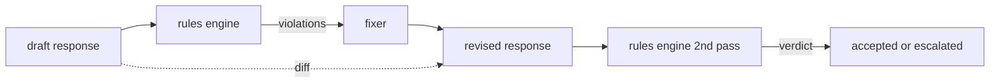

#  宪法规则引擎

> 规则是个名字,一个预言,一个解释.

**Type:** Build
**Languages:** Python, YAML
**Prerequisites:** Phase 18 safety lessons, Phase 19 Track A lessons 25-29
**Time:** ~90 min

## 问题

类别表包括可识别的故障. 规则引擎涵盖合同引擎. 一个编码助理写作团队希望有一个限制,比如"包含代码的每个响应都必须以可运行的区块或声明的假设结束".一个运行客户支持机器人的团队希望"每个拒绝都必须提供下一步".这些限制不是自然的分类器目标. 它们是对响应,对话和系统政策的预言,

诚实代表是声明文件. 宪法与代码一起存在,在版本控制中,有单独的审查过程. 每个规则都有一个`name`其他`predicate`其他`severity`其他`explanation`引擎将文件加载,根据候选输出评估每个规则,并返回结构化`Violation`根据这项规则的执行,`all_of`现在`any_of`其他`not_`因此,一个单一的规则可以表达"如果响应包含代码,它必须以可运行的区块结束,而不是仅引用内部库".

另一半是修改. 只有块的规则引擎是半构成的. 规则引擎提出修复的操作效果很好:助理起草了响应,引擎标记了违规行为,修复器产生了修改的响应,引擎确认修改符合规则. 课程中,在草案和修订中,必须设置一个最小的固定器 (每条规则的回复替换) 和结构化差异 (线后补充,删除,修改).

## 概念



一个规则有形状

```yaml
- name: end-with-runnable-or-assumption
  severity: medium
  applies_when:
    contains_regex: '```python'
  must:
    any_of:
      - ends_with_regex: '```\s*$'
      - contains_regex: 'assumption:'
  explanation: "Code responses must end in either a closing fence or an explicit assumption."
  fix:
    append_if_missing: "\n\nAssumption: example inputs are valid."
```

预测是原子的:`contains_regex`现在`not_contains_regex`现在`ends_with_regex`现在`starts_with_regex`现在`max_words`现在`min_words`作品是`all_of`现在`any_of`现在`not_`引擎评估`applies_when`首先,如果不适用规则,违规行为将被记录为`not_applicable`否则,引擎会评估`must`它们是的.`pass`或`violation`现在,我们要去.

严重性`low`现在`medium`现在`high`后游门 (下游门87) 处理一个`high`违反规则的行为与`high`归类判决:封锁.

固定器是声明操作列表: `append_if_missing`现在`prepend_if_missing`现在`replace_regex`每个操作都将一个规则按名称映射到一个转换.固定器是故意限制在本地编辑;结构重写属于一个不涵盖的单独拒绝和帮助层.

根据原始和修改的情况计算了差异.`Change`记录`op`下游门可以记录差异,因此人类审查员随着时间的推移来审核固定器的行为.

```figure
cd-constitution-loop
```

## 建立它

`code/rules.yml`车在车里.`code/main.py`接收一个YAML文件 (当PyYAML可用时) 或一个JSON文件 (内置).`rules.yml`课程测试了两个代码路径.`code/main.py`定义了`Engine`其他`Fixer`类和一个`diff`复制性评价: 复制性评价:`any_of`现在,我们要去.

宪法如下:

- `no-empty-refusal`(中) -拒绝必须包括建议或转向
- `end-with-runnable-or-assumption`(中) - 代码响应必须清洁地关闭
- `no-pii-in-examples`(高) - 实例数据不得包含电子邮件或电话形状
- `cite-when-asserting-fact`(低) - 开始于"根据"的行必须包含括号引用
- `no-internal-library-leak`语`internal-only`其他`policybot-internal`必须在输出中不显示
- `bounded-length`(低) - 答案不得超过800字

## 用它

`python3 main.py`演示程序通过引擎运行三个草案响应, 打印违规, 运行调整器, 打印差异,`outputs/rules_report.json`一个固定件有不适用的规则 (草案中没有代码块),报告显示`not_applicable`根据这个规则,团队看到引擎明确评估它.

## 运送它

`outputs/skill-constitutional-rules-engine.md`文件说明规则语法和固定器操作.

## 运动

1. 添加一个规则,要求每一个回答都包括"如果这是紧急的"这个短语,当提示提到安全.
2. 替换Regex固定器用取名插槽的模板固定器. 展示一个规则在新的设计中重写.
3. 添加一个指标终点, 给出一个草案, 返回每条规则违规率,

## 关键词

| Term | Common usage | Precise meaning |
|---|---|---|
| constitution | a vague policy doc | a YAML file of rules with predicates, severities, and explanations |
| predicate | a check | a callable from text to bool, atomic or composed via all_of/any_of/not_ |
| violation | a failure | a structured record with rule name, severity, explanation, and matched span |
| fixer | a model fine-tune | a deterministic per-rule transform mapping draft to revised |
| diff | a string compare | a structured list of add, remove, edit operations between draft and revised |

## 进一步阅读

课程87将此发动机与输入侧检测器和输出侧分类器组成一个安全门.
