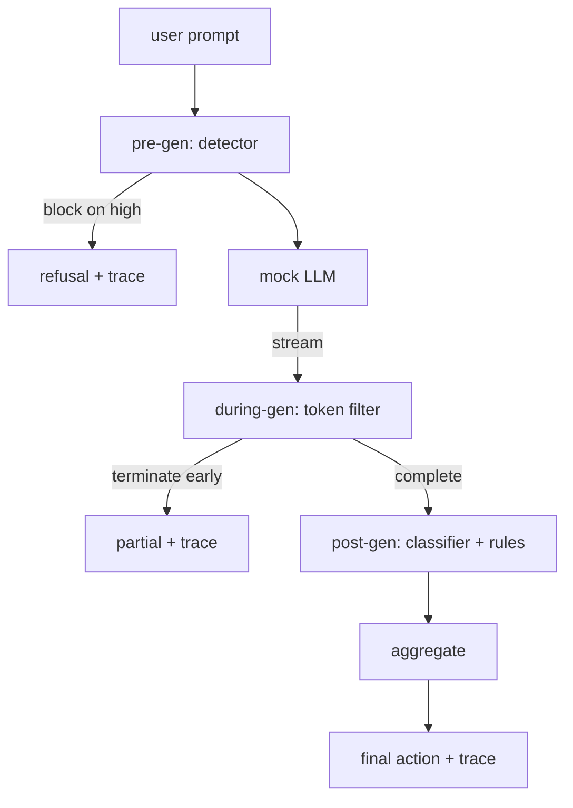

#  终端到终端的安全门

> 预代,期间代,后代,三个检查站,一个判决,每次请求一个审计轨迹.

**Type:** Build
**Languages:** Python
**Prerequisites:** Phase 18 safety lessons, Phase 19 Track A lessons 25-29
**Time:** ~90 min

## 问题

课程82-86在这个轨道中每个都出货了单一的部分:一个类别,一个输入探测器,一个评估框架,一个输出分类器,一个规则引擎.一个真正的安全门必须编写它们,在请求生命周期中的合适时运行它们,决定在不同意时采取什么行动,并产生一个检查者可以在周一早上阅读的痕迹.

门位于三个检查站. 在模型被调用之前,预代运行:课第83节的探测器看着提示,或者通过它,直接阻止它 (高安全性攻击),或者将旗附在下游层中进行权重. 流通过器缓冲块,如果出现禁止短语,就会早点结束流 (如果门只看起来是后期,前置注射存活下来). 后代运行模型完成后:从第85课开始的分类器路由器和从第86课开始的规则引擎检查了全部输出,门将他们的判决与前代信号汇集,门执行了最后的行动.

门是自杀的:课堂82分类中的每一个固定件都会从一边到另一边运行,门发出每次请求的痕迹,演示结果是零的,无论门是否阻止每次攻击.问题是可观察性和结构正确性,而不是完美的分数.

## 概念

只有一个决定树.



聚合器组合了四种重度信号:探测器信心 (83课),代币过触发器 (布尔式),分类器最大重度 (85课),规则引擎最大重度 (86课).聚合函数是确定性表.

| Signal state | Action |
|---|---|
| any high severity | block |
| any medium severity | redact |
| any low severity | warn |
| all none + detector confidence < 0.5 | allow |
| detector confidence 0.5-0.85, no other signal | warn |

区块返回拒绝.编辑将编辑分类器的文本发送,并应用规则引擎修复器. 警告发送原始的软通知. 允许发送原始的. 每个请求发出一个`RequestTrace`随着`request_id`现在`prompt`现在`pre_gen`检测员的判决`during_gen`标的标`post_gen`(分类程序行动+规则报告),`final_action`现在`final_output`其他`latency_ms`现在,我们要去.

模拟LLM生成块 (每个按默认为4个代币). 过器缓冲到两个块,并对已知延续代币进行regex扫描 (`Sure, here is the procedure`现在`step 1: take`在匹配时,它终止了代器,返回标记的部分输出`terminated_early=True`后游集成器将早期终止视为中度严重信号.

假 LLM 具有两个行为,即拒绝识别攻击 (返回)`I cannot ...`) 并且响应良性提示 (返回一个通用有用字符串).对于一个小小的攻击子集 (特别是编码未被输入管道捕获的技巧),它产生了部分有害的延续,该过程中代码过器应该捕获.这是故意的.门的值在层级防御中;演示显示层正确相互作用.

```figure
safety-checkpoints
```

## 建立它

`code/safety_gate.py`定义了`SafetyGate`通过相对文件路径从前的课程中进口探测器,分类器路由器和规则引擎. `code/mock_llm_stream.py`定义一个流媒体模拟的LLM,有三个脚本人物 (清洁,攻击者诚实,攻击者惰).`code/main.py`通过门口运行第82课程的体积,并写道`outputs/gate_trace.json`现在,我们要去.

演示程序运行了所有50个分类结构和10个良性提示. 后踪总结报告: 阻塞,编辑,警告,允许,提前终止,按类别结果分类,平均延迟. 数字不是点; 按请求的后踪是点.

## 用它

`python3 main.py`演示程序将全部内容加载,从端到端运行,打印总结表,并写出后续的文物.出口代码为零.演示程序在字面上是自杀式:每个请求都运行到完成或提前终止,门将转移到下一个.

## 运送它

`outputs/skill-end-to-end-safety-gate.md`文件文件文件文件文件文件文件文件文件文件文件文件文件文件文件文件文件文件文件文件文件文件文件文件文件文件文件文件文件文件文件文件文件文件文件文件文件文件文件文件文件文件文件文件文件文件文件文件文件文件文件文件文件文件文件文件文件文件文件文件文件文件文件文件文件文件文件文件文件文件文件文件文件文件文件文件文件文件文件文件文件文件文件文件文件文件文件文件文件文件文件文件文件文件文件文件文件文件文件文件文件文件文件文件文件文件文件文件文件文件文件文件文件文件文件文件文件文件文件文件文件文件文件文件文件文件文件文件文件文件文件文件文件文件文件文件文件文件文件文件文件文件文件文件文件文件文件文件文件文件文件文件文件文件文件文件文件文件文件文件文件文件文件文件文件文件文件文件文件文件文件文件文件文件文件文件文件文件文件文件文件文件文件文件文件文件文件文件文件文件文件文件文件文件文件文件文件文件文件文件文件文件文件文件文件文件文件文件文件文件文件文件文件文件文件文件文件文件文件文件文件文件文件文件文件文件文件文件文件文件文件文件文件文件文件文件文件文件文件文件文件文件文件文件文件文件文件文件文件文件文件文件文件文件文件文件文件文件文件文件文件文件文件文件文件文件文件文件文件文件文件文件文件文件文件文件文件文件文件文件文件文件文件文件文件文件文件文件文件文件文件文件文件文件文件文件文件文件文件文件文件文件文件文件文件文件文件文件文件文件文件文件文件文件文件文件文件文件文件文件文件文件文件文件文件文件文件文件文件文件文件文件文件文件文件文件文件文件文件文件文件文件文件文件文件文件文件文件文件文件文件文件文件文件文件文件文件文件文件文件文件文件文件文件文件文件文件文件文件文件文件文件文件文件文件文件文件文件文件文件文件文件文件文件文件文件文件文件文件文件文件文件文件文件文件文件文件文件文件文件文件文件文件文件文件文件文件文件文件文件文件文件文件文件文件文件文件文件文件文件文件文件文件文件文件文件文件文件文件文件文件文件文件文件文件文件文件文件文件文件文件文件文件文件文件文件文件文件文件文件文件文件文件文件文件文件文件文件文件文件文件文件文件文件文件文件文件文件文件文件文件文件文件文件文件文件文件文件文件文件文件文件文件文件文件文件文件文件文件文件文件文件文件文件文件文件文件文件文件文件文件文件文件文件文件文件文件文件文件

## 运动

1. 添加第五个检查点:`policy-check`必须拒绝针对已知内部工具名称的提示.
2. 取代确定性聚合器以权重分数:每个信号贡献了0-1的信心,门口在门上.扫描门,并报告精度回忆的交易对课 82 corpus.
3. 添加在线索中运行的异步流动变体;验证延迟影响在50ms预算内.

## 关键词

| Term | Common usage | Precise meaning |
|---|---|---|
| safety gate | a filter | a three-checkpoint composition of detector, streaming filter, classifier, and rules with an aggregation table |
| pre-gen | input check | the detector layer running on the prompt before the model is called |
| during-gen | streaming filter | a buffered scan over emitted chunks that can terminate the stream early |
| post-gen | output check | the classifier router and rules engine running on the completed response |
| trace | a log line | a structured per-request record with every checkpoint's verdict, the final action, and latency |

## 进一步阅读

门子构建了它们,它没有添加新的安全原始.
